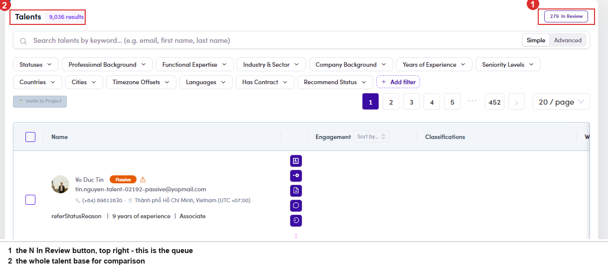

# A6-C · Review the In Review queue, LIVE

> A6 · Approve a new talent (decides Active or Passive)

**Goal:** a new sign-up lands at `In Review` and waits for someone to look at it. You have three ways out: **reject** the person, **approve them to Active**, or **approve them to Passive**. The system offers a recommendation on every profile, but **the button you press is the decision**.

Active and Passive, in one line**Active** means the person can be invited to projects. **Passive** means they stay on the platform but out of the invitation flow, normally because somebody already pays for their week. Getting it wrong sends a project invitation to a person who cannot take it, or hides someone who could.

## A6-C.1 · Open the queue

**User Management → Talents**, then the **N In Review** button at the top right. It is the only way in; there is no In Review tab on the list. Clicking it opens a drawer showing **one profile at a time** rather than filtering the table. For scale: **280 waiting** against **9,036 talents** on the day this was walked. The queue is small next to the base, which is why it is worth clearing properly rather than quickly.

*A6-C.1: ① the N In Review button, top right, the only door into the queue · ② the full talent count beside it.*

## A6-C.2 · Move between profiles without going back to the list

Top right of the drawer sits a pager, **‹ N/280 ›**. The **←** and **→** keys do the same thing. On a narrow window, use the keyboardThe pager sits at the far right edge of the drawer and is the first thing to fall off screen. The arrow keys keep working when the buttons are not visible, so a queue can be walked end to end without ever seeing the pager.

## A6-C.3 · Read the recommendation

The status chip reads **In Review** and carries a **⚠ warning icon** beside it. Hover the icon and you get two lines: The full rule, all five questions and every sentence it can print, is in [A6-C.6 ↗](a6-c-6-how-the-recommendation-works.md).

| Line | What it is | Example |
|---|---|---|
| **Recommend: <status>** | what the rule would pick if it decided | *Recommend: Active* |
| the sentence under it | which of the five questions produced that answer | *Active, self-directed, and nothing ties them to a client company.* |

*A6-C.3: hover the warning icon. Status on top, the reason underneath.*

## A6-C.4 · Check it against the profile yourself

The recommendation is a reading of three fields, nothing more. Read the same three before you accept it: The recommendation is advice, not an instructionIt reads fields; it does not read judgement. A profile can be technically self-employed and still be unavailable, or say Full-time and be about to leave. That is exactly why there are two approve buttons instead of one.

| What to read | Where it is | Why it matters |
|---|---|---|
| **Employment Status** | the header line, under the title | Full-time or Part-time is the strongest signal for Passive. Freelancer, Unemployed and Other point the other way |
| **Current title and company** | Work Experiences, the rows with no end date | wording like *freelance* or *independent consultant* says self-directed whatever the status field claims |
| **Company flag** | on the linked company: **Sponsor**, **Portfolio** or **Corporate** | a current role at a flagged company is the one condition that outranks everything else |

## A6-C.5 · Take one of the three routes, then check it landed

The toolbar at the top of the drawer carries all three: A confirm opens repeating the **name, email and title** so you can check you are on the right record, with **Exit** and **Approve**. The confirm does not name the statusIt asks “Do you want to approve this Talent?” and nothing more. Which status you are about to set came from *the button you pressed*, and there is no second chance to read it back. Check the button colour before you confirm. **What happens next:** the record leaves the queue and the count drops by one. The drawer stays open on the next profile, so a queue can be worked straight through. To confirm the status really changed, search the talent by **name or email** on the Talents list and read the chip.

| Button | Resulting status | When |
|---|---|---|
| **Reject** (red) | **Rejected** | the person does not belong on the platform at all |
| **Approve to Active** (green) | **Active** | they can take project work now |
| **Approve to Passive** (orange) | **Passive** | they belong here, but somebody else already has their week |

*A6-C.5: the confirm names the record but not the status.*

*A6-C: the drawer, all on one screen: ① the three ways out · ② the In Review chip and the warning icon holding the recommendation · ③ Employment Status, the first field the rule reads.*

## In this step

* [A6-C.6 · How the recommendation works](a6-c-6-how-the-recommendation-works.md)
* [A6-C.7 · The rule, rebuilt](a6-c-7-the-rule-rebuilt.md)
