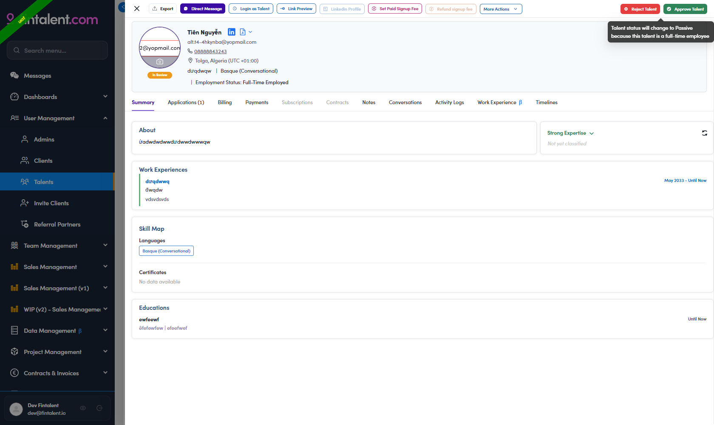
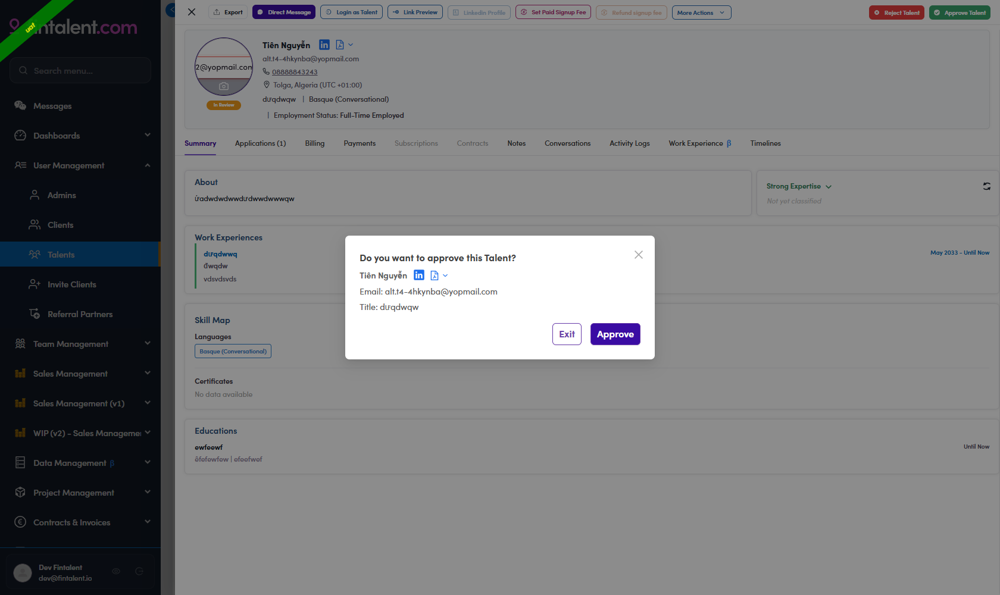

# A6-C · Review the In Review queue — LIVE

> A6 · Approve a new talent (decides Active or Passive)

A new sign-up sits at `In Review`. An admin opens it, clicks **Approve**, and **the system sets Active or Passive by itself**. Your job is to know what it will pick *before* you click, and to flip it afterwards if it picked wrong. **The default is Active** — a record only becomes Passive if a rule fires.

**Five steps, and that is the whole flow.** There is no queue to build, no list to work, no batch:

**Existing records are out of scope.** Nobody re-reviews the Active or Passive population by hand any more — a **the retired existing-records branch** will do that. This page is the intake path only. Production today: **2 records** at In Review; UAT has **286**. Read on production, click on **UAT**.

## A6-C.1 · Open the queue

*User Management → Talents*, then the **N In Review** button at the top right. It opens the queue one profile at a time.

## A6-C.2 · Decide, before you touch any button

You are reading **one profile**, not filtering a list — there is no Company Background chip narrowing things for you. Ask four questions in order and **stop at the first Yes**. This is your **yardstick for step 5**, not a separate approval path: the system decides regardless of what you conclude here. Read the work-experience row, not the headlineEvery title question below is asked of the **position** on a role marked **current** — the job title on the row — and of that row's **company**. The sentence at the top of the profile is a self-description, and it matches none of the positions on **49%** of records. **No current role at all → ACTIVE**, immediately: there is nothing to test. **The employer check on Q4:** stay on the same row — you already have its company — and read that company's name and description. Advisory / consulting / investment bank → **ACTIVE**. Private equity, buyout, LBO, family office, asset manager → **PASSIVE**. The row carries no company, no description, or it reads either way → **ACTIVE**, and write it down so somebody can look again. **Q1 is often unanswerable.** On the UAT queue **76 of 286 (27%)** have **no employment status at all** — they reached In Review without finishing sign-up. The system reads that as “not Full-time” and waves them to **Active** without opening anything else. If the header line is missing, the position questions are the only evidence you have. **Why missing evidence means Active.** The record cannot stay In Review — it has to leave the queue, so there is no "park it and decide later" option. Active is the safe default — a wrongly-Active new sign-up is one record to fix later, a wrongly-Passive one is a freelancer silently shut out from day one. [A6-C.7 ↗](a6-c-7-the-rule-rebuilt.md) does not apply here: a brand-new record has no admin decision behind it yet.

| # | Question | Yes → |
|---|---|---|
| **Q1** | Employment Status says **Full-time or Part-time**? (header line, under the name) | **PASSIVE**, stop |
| **Q2** | A current role's **position** says junior / back office, or advisory / sell-side? `Associate` · `Analyst` · `Intern` · `Investor Relations` · `Fundraising` … and `consultant` · `advisory` · `investment banking` · `due diligence` · `sell-side` … | **ACTIVE**, stop |
| **Q3** | A **position** that only exists inside a fund? Operating Partner · Portfolio Operations · Value Creation · Head of Talent · General Partner · Investment Director / Manager / Professional · Deal Lead | **PASSIVE**, stop |
| **Q4** | A senior **position** that could be anywhere? Partner · Principal · Managing Director · VP · Director · CEO · CFO · Founder · Head of M&A · Corporate Development | do the [A6-C.7 ↗](a6-c-7-the-rule-rebuilt.md) |
| **All four No** | **ACTIVE** |  |

## A6-C.3 · Hover *Approve Talent* before clicking it

The button tells you in advance what the system is about to do — there is no status picker in the dialog, so the tooltip is your only warning. **Approving does not simply mean "Active".** **Compare the tooltip against your own answer from A6-C.2.** If they agree, click Approve. If they disagree, click Approve anyway and fix the status straight after (A6-C.5). Two ways they routinely disagree: **1.** The system has **no seniority check** — an `Analyst` or `Associate` at a flagged company comes out Passive where our rule makes them Active. This is the single biggest source of disagreement, and the reason the rule is being rebuilt ([A6-C.7 ↗](a6-c-7-the-rule-rebuilt.md)). **2.** The system only looks at `Freelancer` — somebody whose Employment Status is *Unemployed* or *Other*, holding a current role at a fund, gets *"will be updated to Active"* while Q3 says Passive. The tooltip is a prediction, not a record of what happenedIt is computed in the browser from what is on screen, so verify with A6-C.5. It has been right on every record checked so far — **three walked end to end on production on 30 Jul 2026, all three matched**. What it never tells you is **which question fired**. The full five-question spine, and how many of them each talent actually walks, is below.

| Tooltip | The system will set |
|---|---|
| *"Talent status will change to Passive because this talent is a full-time employee"* | **Passive** |
| *"… because the employee status is Freelancer and the talent is currently working at a <sponsor / portfolio / corporate> company"* | **Passive** |
| *"Talent status will be updated to Active"* | **Active** |
| *"This talent has been deleted"* | nothing — the record is deleted |

*A6-C.3 — the tooltip on a Full-Time Employed record. The badge still reads In Review and the header line reads Employment Status: Full-Time Employed.*

## A6-C.4 · Click Approve

The dialog is titled **"Do you want to approve this Talent?"** and repeats the name, email and title so you can check you are on the right record. The submit button is **Approve**. There is no status choice in it. To reject instead, use **Reject Talent** — its tooltip warns *"Talent status will be updated to Rejected"*. Rejected is a different outcome from Passive and is not part of this flow.

*A6-C.4 — buttons are Exit and Approve; no status choice.*

## A6-C.5 · Check what the system actually set, and fix it if needed

On approval the record leaves the queue and the **Approve / Reject Talent** buttons disappear from the toolbar — that is your signal it went through. Open it again from the Talents list and read the status chip. *Walked end to end on UAT: a Full-Time Employed record, tooltip predicting Passive, came back **Passive**.* The chip is **unlocked now**; it was read-only while the status was In Review, which is exactly why this is a two-step job. The Passive dialog opens on the wrong reason **Set Talent Status to Passive** carries a radio group with *Unable to verify freelance status* **already selected**, plus a free-text **Reasons** box. Those first three options belong to the freelance-verification review, not to this correction — overruling the rule concludes something else entirely. **Always switch to `Other`.** Click **Yes** without touching the radio and the wrong reason is stored permanently, on every record you process. The Reasons box is **not enforced** either: on UAT, `Other` with an empty box saved fine and the record then showed only the word *"Other"*. One line is enough — `S7 — current role at <company>, flagged <sponsor|portfolio|corporate>. Client, not supply.` Going the other way is simpler: **Set Talent Status to Active** has no radio group and no reason field. **The asymmetry is worth knowing** — a record corrected *to* Active carries no record of why the rule was overruled, so put it in Notes if it matters. **Then verify twice.** Hover the chip — on Passive it now reads *"Passive since <date> at <time>"* followed by the radio value. Then open **Timelines** and **reload the page**: the tab count does not refresh on its own. Your entry reads `Active → Passive`, which is what distinguishes it from the automatic one — that reads `In Review → Passive` and carries the approving admin’s name anyway. Any later migration goes by the transition, not the name, so a corrected record is left alone.

| Situation | What to do |
|---|---|
| Chip matches your A6-C.2 answer | done |
| You need **Passive**, the system set Active | click the chip, pick **Passive**, then **change the radio to Other** and type the reason — see the trap below |
| You need **Active**, the system set Passive | click the chip and pick **Active** |

## Two other things that happen in this queue

| **A Passive talent resubmitting** | that is `ReviewPassive`, not `InReview`, and it has its own toolbar with three buttons — *Approve Review Passive*, *Reject Review Passive*, *Reject Talent*. See [A6.x.2 ↗](a6-x-2-a-passive-talent-resubmits.md) |
|---|---|
| **The status chip is locked while In Review** | you cannot pre-set the outcome. Approve first, correct after |

## In this step

* [A6-C.6 · The rule as built today](a6-c-6-the-rule-as-built-today.md)
* [A6-C.7 · The rule, rebuilt](a6-c-7-the-rule-rebuilt.md)
