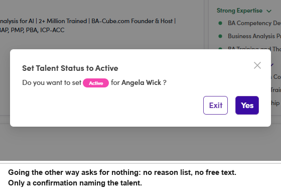

# A6-D.3 · Passive → Active

> A6 · Approve a new talent (decides Active or Passive) → A6-D · Re-check an existing status

## A6-D.3 · The same walk, with the filters the other way round and no reason to give

Set **Statuses = Passive** and **Recommend Status = Active**, open a record, read it, then click the chip and pick **Active**. **Set Talent Status to Active** asks one question, *“Do you want to set Active for <name>?”*, and offers **Exit** and **Yes**. No reason list, no free text.

> **Only one direction is asked to explain itself**
>
> Making somebody Passive takes them out of the invitation flow, so the system asks why. Putting them back does not, which means a record can go Active with nothing on file about who decided or why. If you want that written down, put it in **Notes** yourself.

*A6-D.3: the whole dialog. Nothing to fill in.*
