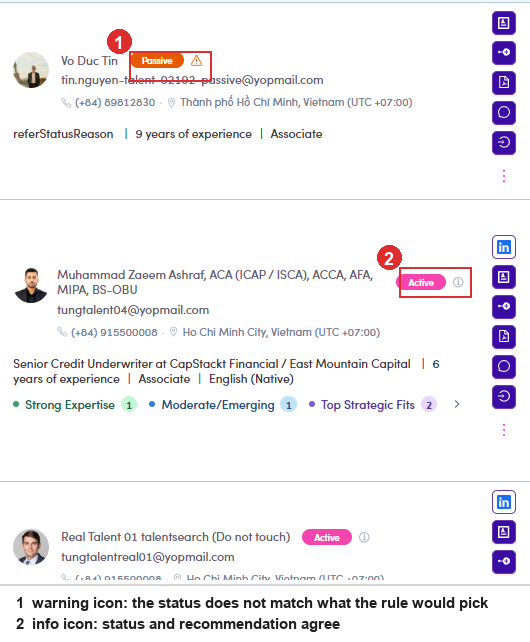
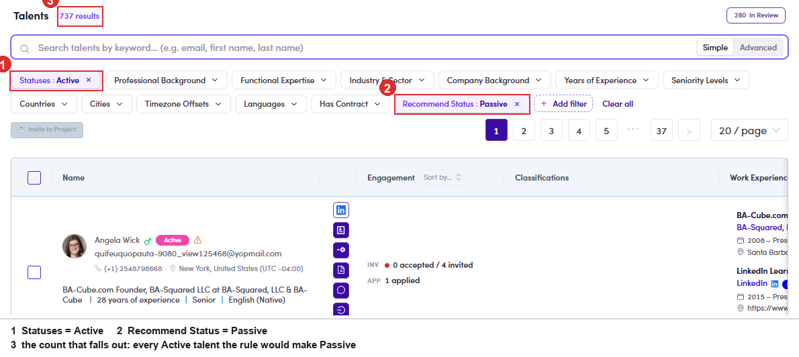
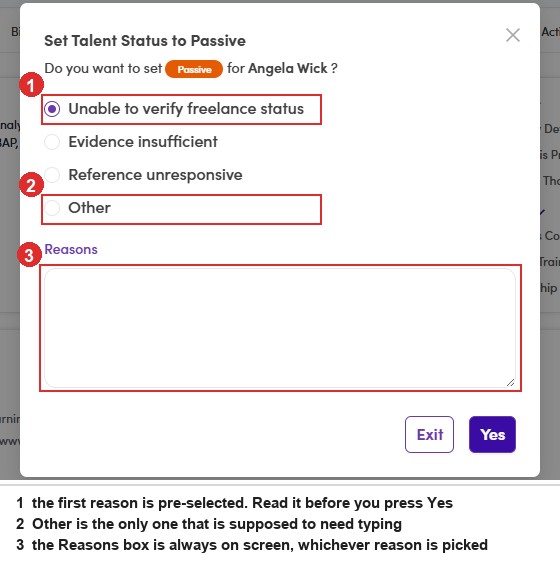

# A6-D · Re-check an existing status

> A6 · Approve a new talent (decides Active or Passive)

**When to run this:** when you want to know whether the statuses already on the platform are still right. It applies to **Active** and **Passive** records, not to the queue. Nothing here is automatic: the system points, you decide.

## A6-D.1 · Read what the system thinks

## A6-D.1 · The icon beside the status chip tells you whether the two agree

It is on the **Talents list** and on the profile drawer, in both places, in the same shape: Hover either icon for the same two lines as in the queue: the recommended status, then the reason.

| Icon | Meaning | What to do |
|---|---|---|
| **⚠ warning** | the current status **does not match** what the rule would pick | worth opening; it may be right anyway |
| **ⓘ info** | status and recommendation **agree** | nothing to do |
| no icon | the rule has no opinion on this record | judge it by hand or leave it |

*A6-D.1: ① warning, status and recommendation disagree · ② info, they agree.*

## A6-D.2 · Active → Passive

## A6-D.2a · Build the list of candidates

On **Talents**, set **Statuses = Active**. Then **+ Add filter** → under **Availability & Engagement** tick **Recommend Status**, which pins it to the filter bar. Open it and pick **Passive**. The dropdown offers only **Active** and **Passive**. What comes back is every Active talent the rule would have made Passive. **737 of them** when this was walked, so treat it as a working queue rather than a list to clear in one sitting.

*A6-D.2a: ① Statuses = Active · ② Recommend Status = Passive · ③ what falls out.*

## A6-D.2b · Open one and read it before you touch the chip

Same three fields as [A6-C.4 ↗](a6-c-review-the-in-review-queue.md): Employment Status, the current title and company, and whether that company is flagged. **Leaving it alone is a valid outcome**, the rule is often pointing at a record that a human already judged correctly.

## A6-D.2c · Change it from the status chip

The chip on the profile carries a caret. Click it and you get exactly one alternative, **Passive**. Picking it opens **Set Talent Status to Passive**, which asks for a reason: Then **Yes**. The chip flips to Passive and the icon beside it changes from warning to info, because status and recommendation now agree.

| Reason | Needs typing? |
|---|---|
| **Unable to verify freelance status** (pre-selected) | no |
| **Evidence insufficient** | no |
| **Reference unresponsive** | no |
| **Other** | yes, in the **Reasons** box |

> **Two things to watch in this dialog**
>
> **The first reason is already selected when it opens.** Press Yes without reading and you have filed “Unable to verify freelance status” on a record where that may be untrue. **🐛 And *Other* does not actually enforce anything.** Picking Other and leaving the Reasons box empty saves without complaint, no error, no disabled button. The reason is meant to be required and is not.

*A6-D.2c: ① pre-selected reason · ② Other · ③ the Reasons box, on screen whichever reason is picked.*

## A6-D.3 · Passive → Active

## A6-D.3 · The same walk, with the filters the other way round and no reason to give

Set **Statuses = Passive** and **Recommend Status = Active**, open a record, read it, then click the chip and pick **Active**. **Set Talent Status to Active** asks one question, *“Do you want to set Active for <name>?”*, and offers **Exit** and **Yes**. No reason list, no free text.

> **Only one direction is asked to explain itself**
>
> Making somebody Passive takes them out of the invitation flow, so the system asks why. Putting them back does not, which means a record can go Active with nothing on file about who decided or why. If you want that written down, put it in **Notes** yourself.

*A6-D.3: the whole dialog. Nothing to fill in.*

## In this step

* [A6-D.1 · Read what the system thinks](a6-d-1-read-what-the-system-thinks.md)
* [A6-D.2 · Active → Passive](a6-d-2-active-passive.md)
* [A6-D.3 · Passive → Active](a6-d-3-passive-active.md)
