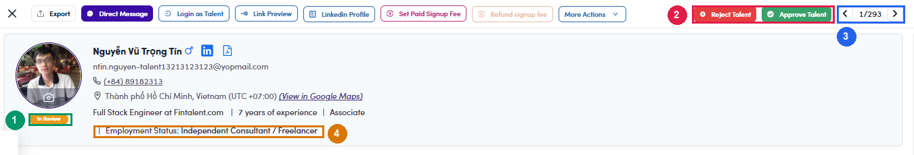

# A6.x.1 · New sign-ups to approve

> A6 · Approve a new talent (decides Active or Passive) → A6.x · Edge cases

**The *In Review* queue, new sign-ups waiting for approval.** The **N In Review** button at the top right of the talents list opens the queue one profile at a time. **Approving does not simply mean “Active”.** The confirmation dialog repeats the name, email and title; on **Approve** the system then applies an automatic rule and picks the resulting status itself. **The rule is the five-question spine in [A6-A ↗](a6-a-6-the-rule-that-runs-today.md)**, employment status, then the position and company of each current role, then the flag on those companies. It records **when** the status changed but not **why**, so the profile gives no explanation afterwards. **An unlinked company can never fire it.** The trigger is the flag on the *linked* company, an ongoing role at a company that was never matched to the Mergermarket list does **not** fire Q5, whatever that company actually is. Roughly **63%** of talents have a current employer in that state ([A6.x.5 ↗](a6-x-5-employer-missing-from-the-company-list.md)). **Ruled 28 Jul 2026: this is intended behaviour, not a defect, but it is narrower than the business rule.** The system deciding a status at approval is by design. Two gaps remain, and both are for a human to close: it fires on a plain **corporate** flag, which is group D and out of scope; and it never reads **Employment Status**, so it cannot enforce the gate in [A6-A.7 ↗](a6-a-7-the-rule-as-proposed.md). Neither gap is logged as a bug. They are the reason the **the retired existing-records branch** branches exist. **Two things worth knowing about the queue itself:** The chip is locked while the status is In Review, so a client has to be approved first and set Passive afterwards per [A6-A.7 ↗](a6-a-7-the-rule-as-proposed.md).

*A6.x.1: ① status chip reads In Review and is not editable · ② Reject Talent → status becomes \*Rejected\*; Approve Talent → confirmation dialog, then the talent enters the normal pool · ③ pager, step through the whole queue without going back to the list · ④ Employment Status, visible on the header.*

> **This is where most wrongly-Passive talents come from**
>
> Freelancers get set Passive **at approval time** purely because they hold a current job at a flagged company, **whatever the seniority of that job**. An `Analyst` or `Associate` is supply, and the rule has no check for it. Nobody clicked anything, and because the rule writes no reason, the profile gives no explanation afterwards. If you are auditing Passive talents, start here.

- After each decision the drawer **advances to the next profile** and the counter drops, so the whole queue can be worked without returning to the list.

- The queue drawer **does not put the talent id in the URL**, so a profile being reviewed cannot be linked to. Opening the same person from the list **does** give you an address you can copy, and the Approve / Reject buttons are there too, so use that route when you need to share or come back.
