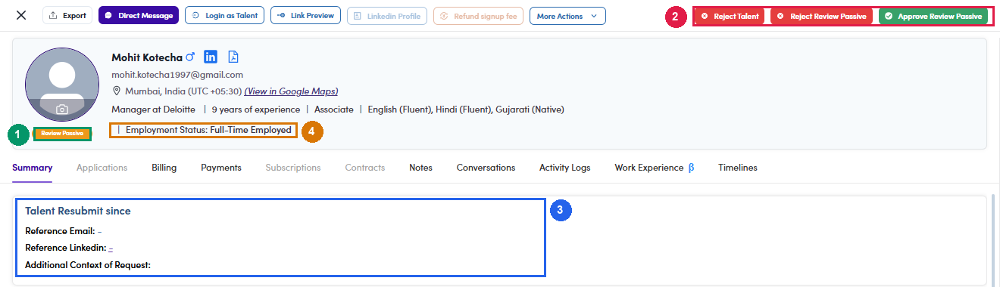

# A6.x.2 · A Passive talent resubmits

> A6 · Approve a new talent (decides Active or Passive) → A6.x · Edge cases

***ReviewPassive* — a Passive talent resubmitted their profile.** The profile shows a *Talent Resubmit since <date>* panel next to the original Passive reason, and the toolbar offers **three** buttons instead of two: The Summary tab opens with a **Talent Resubmit since** panel carrying what the talent supplied to support the request: **Reference Email**, **Reference Linkedin** and **Additional Context of Request**. Those three fields are the evidence you are judging — an empty panel means they asked for reactivation without supplying anything. Always read the original Passive reason first — it is shown on the same screen. Approving without checking whether the resubmission actually addresses it defeats the point of the queue.

| Button | Resulting status | When to use it |
|---|---|---|
| **Approve Review Passive** (green) | **Active** | the new evidence answers the original reason |
| **Reject Review Passive** (red) | **Passive** | nothing material changed — back to where they were |
| **Reject Talent** (red) | **Rejected** | they do not belong on the platform at all |

*A6.x.2 — ① the chip reads Review Passive and is not editable · ② the three decision buttons · ③ the Talent Resubmit since panel with the supporting fields · ④ Employment Status, still worth reading.*
