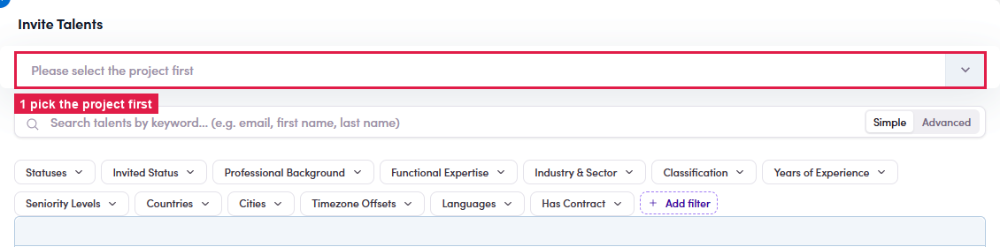
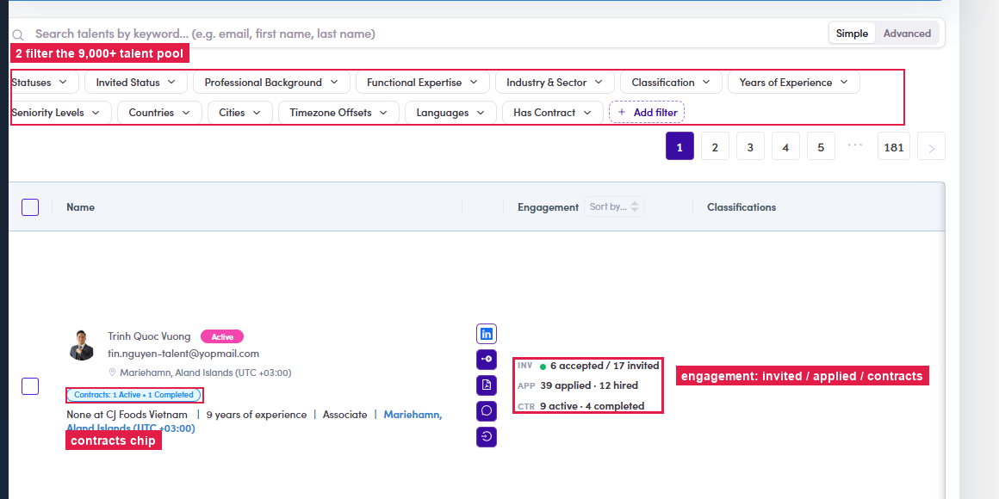
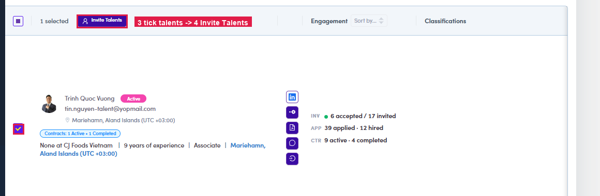

# B1 · Invite talents to a project

> ADMIN

1. **B1.1** — **Project Management → Invite Talents.** The page asks you to **select the project first** — the dropdown lists each project as a card: title, client & contact, **#PR id**, seniority / experience / rate type / duration / timezone / languages, and its running score — **“X invited · Y applied”**.

   

   *B1.1 — pick the project; each option shows client, #PR id and invited / applied counts.*

2. **B1.2** — **Filter the pool.** The full talent pool loads (9,000+). Cut it down with the filter bar — **Statuses · Invited Status · Professional Background · Functional Expertise · Industry & Sector · Classification · Years of Experience · Seniority Levels · Countries · Cities · Timezone Offsets · Languages · Has Contract**.

3. **B1.3** — **Read a talent row** before inviting: the **Active** badge, their title & experience, a **Contracts chip** (“1 Active · 1 Completed”), and the **Engagement** column — **INV** accepted/invited · **APP** applied/hired · **CTR** active/completed contracts. Row icons open LinkedIn, the CV (PDF) and chat.

   

   *B1.2–3 — filter the pool; each row carries the engagement stats and a contracts chip.*

4. **B1.4** — **Tick the talents → Invite Talents.** Selecting rows reveals the **👤 Invite Talents** button (top bar) — it sends the project invite to everyone selected; the project's **invited** count goes up and the talent shows under **Invited Status**.

   

   *B1.4 — tick talents → Invite Talents.*
