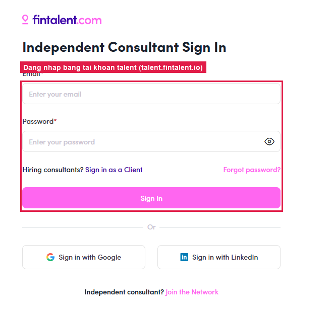
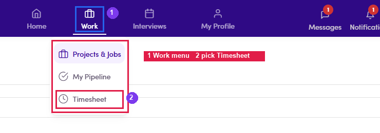
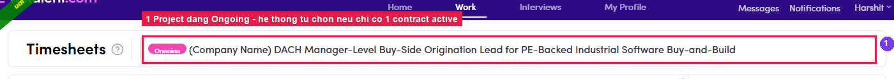

# B2.1 · Open Timesheet

> B2 · Talent · log & submit timesheet

1. **B2.1.1** — **Sign in to the talent portal** (`talent.fintalent.io`) with the talent account.

   

   *B2.1.1 — the Independent Consultant Sign In screen of the talent portal.*

2. **B2.1.2** — Open the **☰** menu (top left) → group **Work** → **Timesheet**. (Timesheet lives in the ☰ menu — it is not on the bottom navigation bar.)

   

   *B2.1.2 — ① the Work group · ② the Timesheet entry.*

3. **B2.1.3** — **Pick the project to log against.** With **only one Active contract** the system **selects it for you** — the name shows in the top bar with an **Ongoing** label, nothing to do. With **several Active contracts**, **click that bar** to open the list and switch project; each project has its **own** calendar, totals and submission queue. Details in [B2.x.5 ↗](b2-x-5-several-projects.md).

   

   *B2.1.3 — the project bar with its Ongoing label; with a single Active contract the system picks it automatically.*

4. **B2.1.4** — **Read the totals panel** before doing anything — these three numbers measure the whole flow:

   | Line | What it means |
   |---|---|
   | **… submitted** | Total **hours to bill** locked in — **the number the money follows**. |
   | **Worked: …** | Total hours actually **logged**. Can exceed the submitted figure when the talent has billed less than they worked. |
   | **… pending submission** | Hours logged but **not yet submitted**. At **0h** the Submit button is greyed out. |

   

   *B2.1.4 — ① submitted = hours to bill · ② Worked = hours logged · ③ the Submit button, enabled only when hours are pending.*
