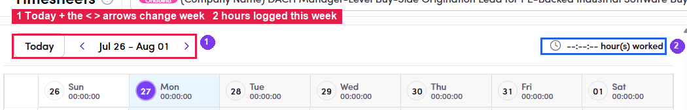
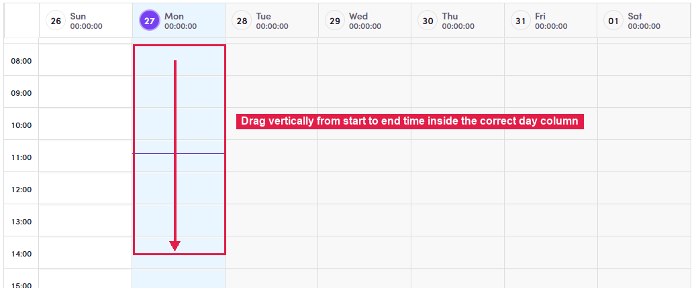
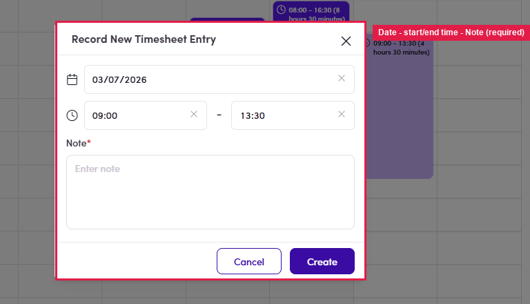
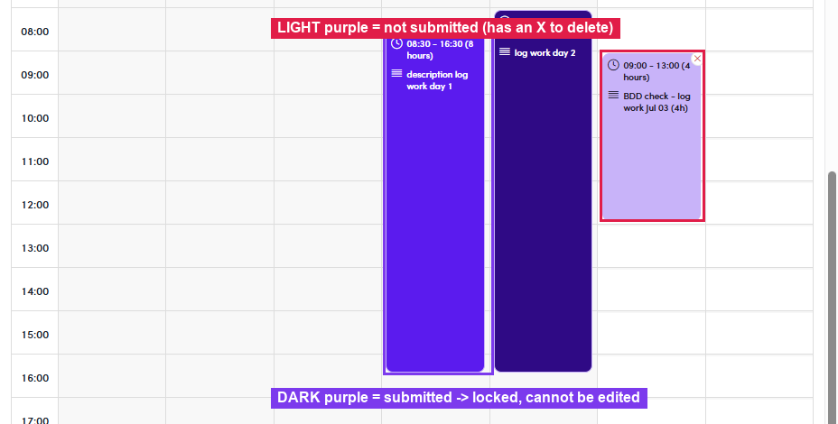
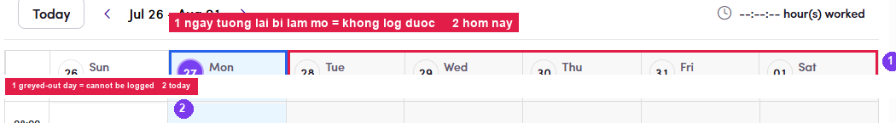

# B2.2 · Log work

> B2 · Talent · log & submit timesheet

## B2.2.1 · Go to the right week

Use **‹** / **›** next to **Today**.

*B2.2.1 — ① Today plus the ‹ › arrows change week · ② hours logged for the week.*

## B2.2.2 · Drag on the hour grid

in the correct day column, from start time to end time.

*B2.2.2 — drag vertically inside the right day column, from start to end time.*

## B2.2.3

The **Record New Timesheet Entry** dialog opens — check the **Date**, correct the **start / end time**, and **a Note is mandatory** (it describes the work and is printed in the invoice appendix).

*B2.2.3 — Date · start–end time · Note (required) → Create.*

## B2.2.4

Click **Create**. The entry appears on the calendar in **light purple** = **not submitted**. **Dark purple** means submitted — **locked**.

*B2.2.4 — light purple = not submitted (editable, deletable) · dark purple = submitted (locked).*

## B2.2.5 · Edit or delete an unsubmitted entry

Two different actions, easy to mix up:

- **Click the body of the entry** → opens **Modify Timesheet Entry** — change the time or the Note, then **Update**.

- **Click the ✕ in the top-right corner of the entry** → **deletes** it.

*B2.2.5 — ① the ✕ delete button · ② click the entry body to edit · ③ the colour legend (submitted / pending) · ④ hours still pending submission.*

## B2.2.6 · Which days can be logged?

A greyed-out day cannot be logged — **four** reasons:

| Case | Why |
|---|---|
| Day **before the contract Start date** | No contractual work existed yet. |
| Day **already submitted** | Hours to bill are locked in. |
| Day **in the future** | Only work already done can be logged. |
| Day **already on an invoice** | Submitted and then billed by Admin — locked permanently. |

| Side | Jul 9 (a gap inside the invoiced range Jul 8–10) |
|---|---|
| **Talent** | Day cell is white → drag creates an entry → Create works → **submit works** |
| **Admin** | *Create Client Invoice* does **not prefill** the service period, **Quantity = 0**; opening the picker shows **Jul 8, 9, 10 all disabled** → unselectable |

*B2.2.6 — ① greyed-out day = cannot be logged · ② today.*
