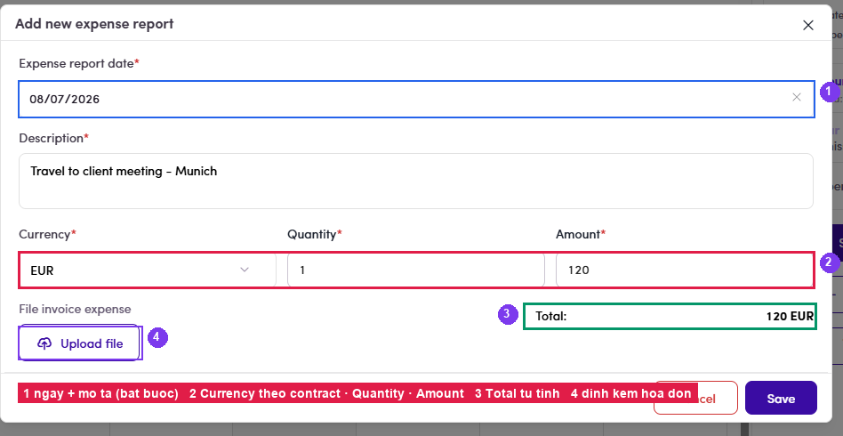
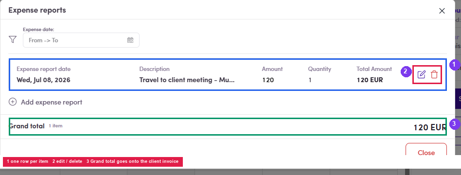

# B2.3 · Expense report

> B2 · Talent · log & submit timesheet

OptionalThe talent **may or may not** file one. Once filed, the amount is **added to the same client invoice** — separately from the fee, and it does not touch the hours.

## B2.3.1

Click **+ Add expense report** (directly below **Submit Timesheet**) → the **Add new expense report** dialog opens.

## B2.3.2 · Fill in the required fields

**Expense report date** (when the cost was incurred) · **Description** (goes onto the invoice) · **Currency** (defaults to the contract currency) · **Quantity** · **Amount**. The **Total** line calculates itself as Quantity × Amount. You can also **Upload file** to attach the original receipt.

*B2.3.2 — ① date + description · ② Currency · Quantity · Amount · ③ Total, calculated · ④ receipt attachment.*

## B2.3.3

Click **Save**. The panel on the right changes from **0 expense report** to **1 expense report**.

## B2.3.4 · Review / edit / delete

click the **N expense report** line → the **Expense reports** dialog: one row per item (date · description · Amount · Quantity · **Total Amount**) with **✎** edit and **🗑** delete buttons, an **Expense date** filter, and a **Grand total** at the bottom.

*B2.3.4 — ① one row per item · ② edit / delete · ③ Grand total — this is what gets added to the client invoice.*
