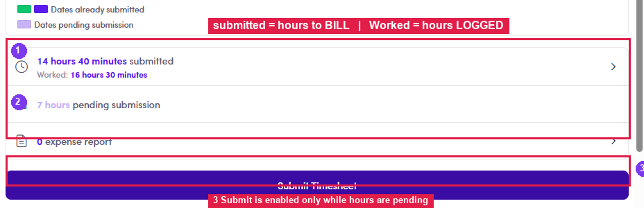
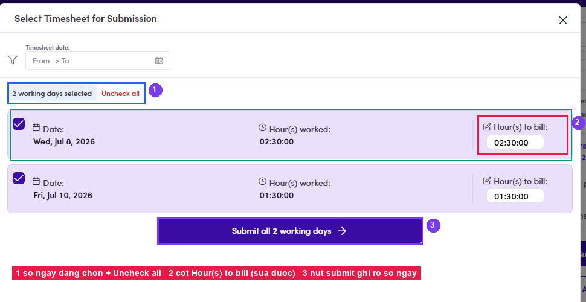
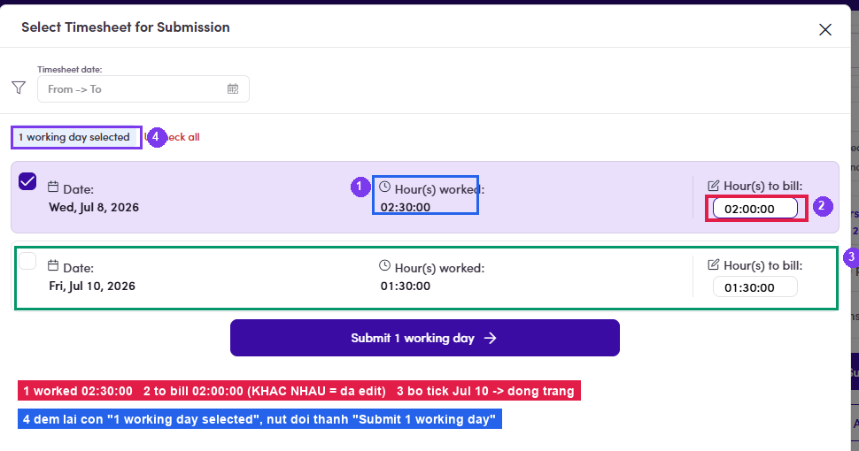
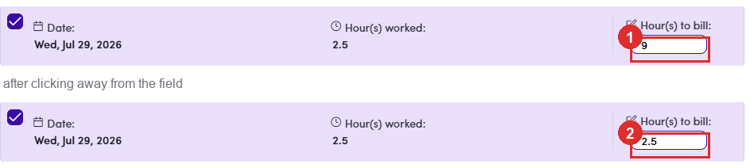
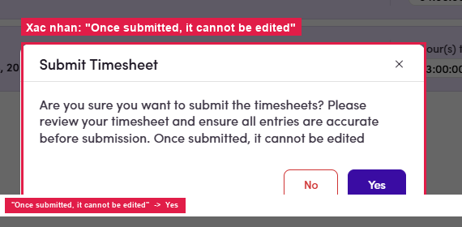

# B2.4 · Submit & edit the timesheet

> B2 · Talent · log & submit timesheet

Submitting is one-wayThe confirmation dialog says it outright: **“Once submitted, it cannot be edited”**. Check the hours carefully before clicking Yes.

## B2.4.1

Click **Submit Timesheet** (enabled only when **pending submission > 0h**). If the dialog opens with **no submit button** and a **“Update your billing or payment details”** warning instead, the account is missing its **billing address / payment info**. Fix it in [B2.x.7 ↗](b2-x-7-billing-payment-info.md) and come back.

*B2.4.1: ③ the Submit Timesheet button, enabled only while hours are pending.*

## B2.4.2

The **Select Timesheet for Submission** dialog lists **one row per pending day** (not per entry, several entries on the same day are merged). Everything is **ticked by default**; at the top there is a **“N working days selected”** counter and an **Uncheck all** link. Narrow the list with the **Timesheet date** range (From → To).

*B2.4.2: ① counter + Uncheck all · ② the editable Hour(s) to bill column · ③ the submit button spells out how many days are selected.*

## B2.4.3 · Adjust *Hour(s) to bill

* if needed. Each row has two columns: **What counts as “edited”:** the two columns on the same row **differ**. Equal = logged hours kept as-is; different = the talent deliberately set a different billable figure.

| Column | Editable? | Meaning |
|---|---|---|
| **Hour(s) worked** | No | Exactly what was logged, kept as the reference. |
| **Hour(s) to bill** | **Yes** | The hours actually charged. Defaults to the logged hours; lower it when only part of the time was agreed. |

*B2.4.3: a real example: ① worked 02:30:00 · ② to bill 02:00:00 → different = edited. ③ the Jul 10 row unticked (turns white) · ④ the counter now reads 1 working day selected.*

| You type | While typing | After you click away |
|---|---|---|
| **9** or **2.6**, above the logged hours | shows what you typed | **2.5**, pulled back down |
| **0** | 0 | **0**. Allowed, you can bill nothing |
| **−1** | −1 | **0**, pulled back up |

*B2.4.3: a 2.5 h day: ① 9 typed into Hour(s) to bill · ② the same field after clicking away, back to 2.5, with no message in between.*

## B2.4.4 · Decide which days to submit

The button at the bottom **rewrites itself to match the ticked rows**: both days ticked → **Submit all 2 working days**; untick one → **Submit 1 working day**. Read that button before clicking: it is the fastest way to see what you are about to lock in. Details in [B2.x.3 ↗](b2-x-3-partial-submit.md).

## B2.4.5

The **Submit Timesheet** confirmation appears → click **Yes**. (Clicking No returns you to the list; skip this dialog and nothing you did takes effect.)

*B2.4.5: “Once submitted, it cannot be edited” → Yes.*
