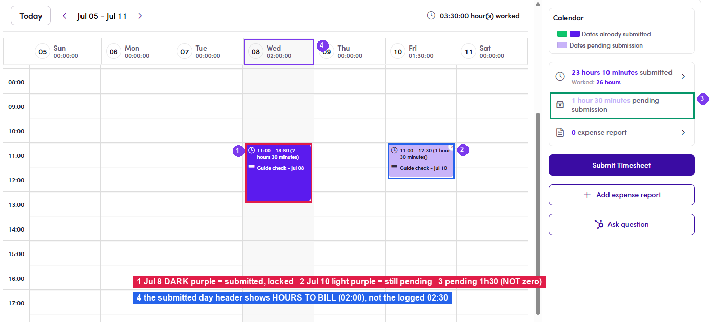

# B2.5 · Verify after submit

> B2 · Talent · log & submit timesheet

## B2.5.1 · *pending submission* must drop by exactly what you just submitted

It does **not** have to reach 0h: Seeing pending > 0 after a submit is **not a bug**, check whether a day was left unticked.

| What you just did | pending afterwards |
|---|---|
| Ticked **every** day, then submitted | **0h** |
| Unticked some days (partial submit) | **> 0h**, exactly the hours of the days left behind |

## B2.5.2 · submitted

rises by the total *hours to bill* you just locked in; **Worked** rises by the total *hours logged*. The gap between the two is exactly what was edited in [B2.4.3 ↗](b2-4-submit-and-edit-the-timesheet.md). **Example 1: submit everything:** before: submitted 14:40 / worked 16:30. Log 4h (Jul 3) + 3h (Jul 4) = 7h, submit with to bill 3:30 + 3:00 = 6:30. After: **submitted 21:10** (14:40 + 6:30), **worked 23:30** (16:30 + 7:00) and pending **0h**. **Example 2: partial submit:** before: submitted 21:10 / worked 23:30 / pending 0h. Log Jul 8 (2:30) and Jul 10 (1:30) → pending **4h**. Tick only Jul 8, lower to bill to **2:00**, submit. After: **submitted 23:10** (+2:00 = hours to bill), **Worked 26:00** (+2:30 = hours logged) and pending **1:30** (Jul 10 still waiting).

## B2.5.3 · The submitted day turns dark purple

and can no longer be edited; a day **left behind stays light purple**, keeps its **✕** button and is still editable.

*B2.5: example 2 above: ① Jul 8 dark purple = locked in · ② Jul 10 light purple = still pending · ③ pending 1h30 (not zero) · ④ the submitted day column header reads 02:00 = hours to bill, not the 02:30 that was logged.*

## B2.5.4 · Check the colour legend

The **Calendar** box in the top right lists only the states actually present: **Dates already submitted** (green / dark purple) and **Dates pending submission** (light purple). No *pending* line means everything has been submitted.

That completes the talent's part: Admin takes over: [B3 · Manage timesheet → invoice ↗](b3-timesheet-invoice-admin.md).
