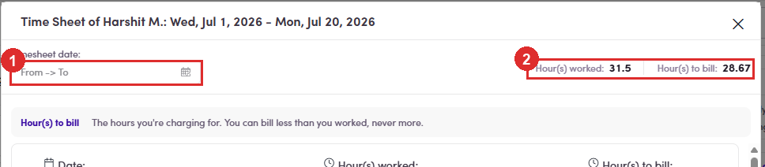
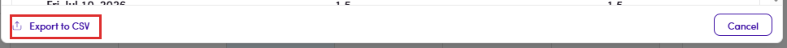

# B2.6 · After you submit

> B2 · Talent · log & submit timesheet

## B2.6.1 · It is approved the instant you submit

There is no waiting, no review queue, nobody to chase. The submission is created already **Approved** — and the account recorded as approving it is **your own**. The label does not say “Approved” thoughYour side shows **Submitted**. Admin's side shows **Approved**. Same record, two words — so “has it been approved yet?” has no answer you can read off the screen, because the answer is always yes. See [B3.0 ↗](b3-timesheet-invoice-admin.md) for the admin view of this.

## B2.6.2 · Open the summary of everything you have submitted

click the **“N hours submitted”** panel on the right. It opens **Time Sheet of <your name>** with the full date range in the title.

| In the dialog | What it gives you |
|---|---|
| **Timesheet date** | a From → To filter, for pulling out one billing period. |
| **Hour(s) worked** / **Hour(s) to bill** | the two totals for whatever range is showing — the gap between them is everything you trimmed at submit time. |
| one card per day | date, hours worked, hours to bill, side by side. |

*B2.6.2 — ① the date-range filter · ② worked vs to bill for that range.*

## B2.6.3 · Export to CSV

sits at the bottom left of that dialog, and it exports **what the filter is showing**. Set the range first, then export — that is the quickest way to produce a per-period record for your own books.

*B2.6.3 — Export to CSV, bottom left.*

## B2.6.4 · Nothing here is editable

The dialog is a record, not a form — there is no way back into a submitted day from it. If a submitted figure is wrong, you cannot fix it yourself; ask Fintalent through **Ask question** ([B2.x.6 ↗](b2-x-6-ask-question.md)).
