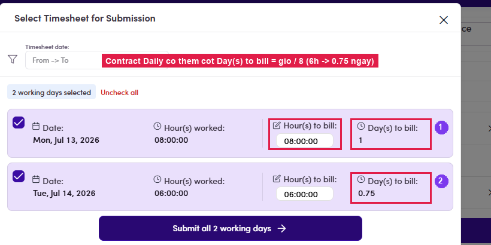

# B2.x.1 · Daily: Day(s) to bill

> B2 · Talent · log & submit timesheet → B2.x · Edge cases

**Daily contracts: an extra *Day(s) to bill* column.** On a per-day contract the submit dialog adds a **Day(s) to bill** column that is **calculated, not directly editable**: **one working day = 8 hours** (log 8h → 1 day; log 6h → 0.75 day). The talent still only edits **Hour(s) to bill**; the day count follows from it. Known display defectWhen **Hour(s) to bill** is edited, the **Day(s) to bill** column in this dialog **does not recalculate immediately**. It keeps showing the value derived from the logged hours. The invoice total is **still correct** (it derives from hours to bill). See [B3.x.4 ↗](b3-x-4-the-two-pdf-pages-differ.md).

*B2.x.1: Daily contract: Day(s) to bill = hours ÷ 8, shown next to Hour(s) to bill.*
