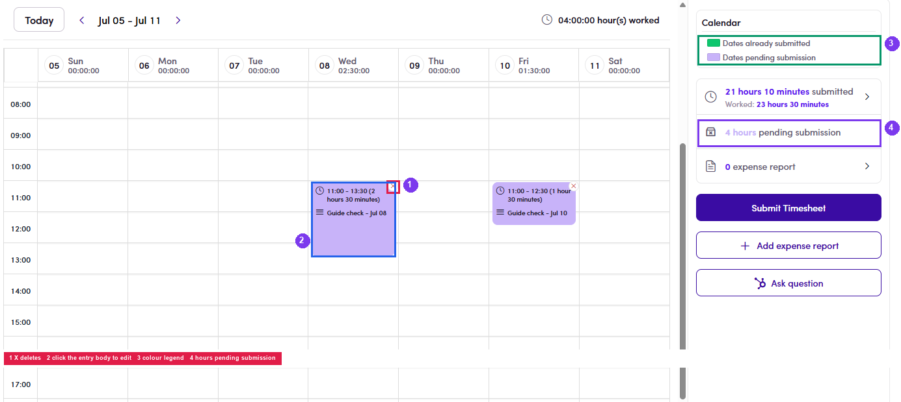

# B2.x.4 · Fixing a mistake

> B2 · Talent · log & submit timesheet → B2.x · Edge cases

**What if something was entered wrongly?**

- **Before submitting**: fixable: click the **entry body** to open **Modify Timesheet Entry** (change time / Note → **Update**), or click **✕** to delete it and log again.

- **After submitting**: **not fixable**; the confirmation said *“Once submitted, it cannot be edited”*. Tell Admin/Ops before the invoice is issued.

- **After an invoice exists**: invoiced days are locked permanently and only Admin/Ops can intervene. A gap day inside an invoiced range is **loggable but not billable**, **do not log it retroactively**, tell Admin/Ops. See [B2.2.6 ↗](b2-2-log-work.md).

*B2.x.4: ① ✕ deletes · ② click the entry body to edit. Both exist only on light purple entries; dark purple ones have neither.*
