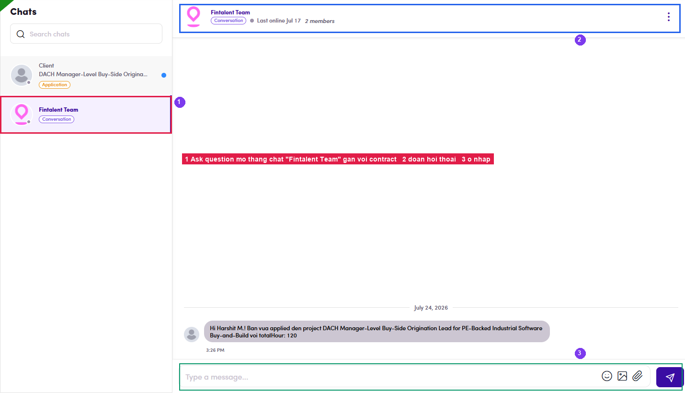

# B2.x.6 · Ask question

> B2 · Talent · log & submit timesheet → B2.x · Edge cases

**Ask question — reach Fintalent without leaving the flow.** The **Ask question** button (below *Add expense report*) **does not open a form**; it jumps straight into **Chat**, to the **Fintalent Team** conversation attached to the selected contract (`/chat/<contractId>`). Use it after a wrong submit, a missing day, or when the billable hours are unclear.

*B2.x.6 — ① the two chat threads: Client (Application) and Fintalent Team (Conversation) · ② the messages · ③ the compose box.*
