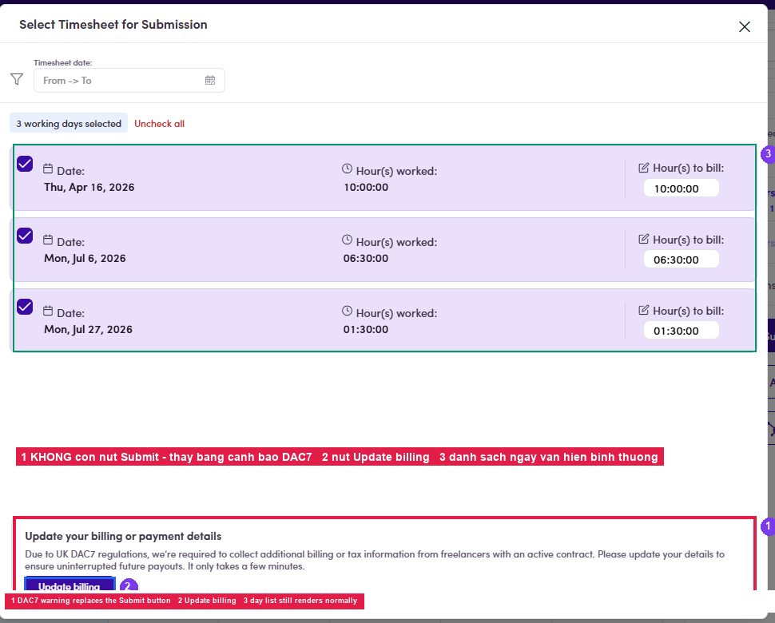
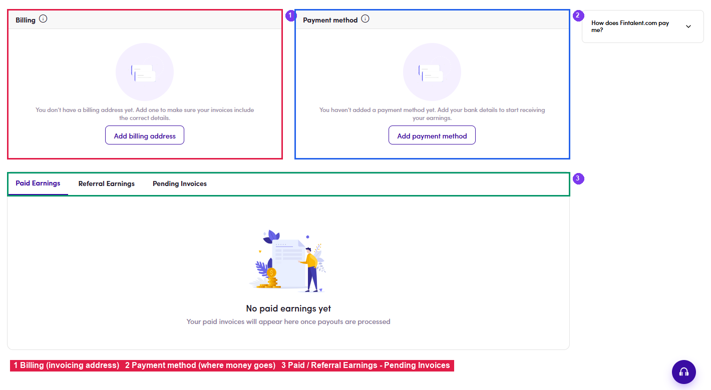

# B2.x.7 · Billing / payment info

> B2 · Talent · log & submit timesheet → B2.x · Edge cases

**No billing address / payment info → submitting is blocked.** A talent with an Active contract who has not filled these in can still **log work normally**. Entries are created, **pending submission** grows, but at the submit step the dialog has **no Submit button**, only a warning: *“Update your billing or payment details — Due to UK DAC7 regulations, we're required to collect additional billing or tax information from freelancers with an active contract…”* Easy to misreadThe block happens **at submit time, not at log time**. A talent can log a whole week before discovering they cannot submit, so fill these in as soon as the contract goes Active. **Where to fill them in:** click **Update billing** inside the warning, or go to **My Profile → My Earnings** (`/earnings`). The page has **two separate cards** and **both** must be completed to clear the block: Once both are saved, return to [B2.4 ↗](b2-4-submit-and-edit-the-timesheet.md). The submit dialog shows its normal button again.

*B2.x.7a: ① where the Submit button should be → the DAC7 warning instead · ② the Update billing button · ③ the day list still renders normally, which is why it looks submittable.*

*B2.x.7b: ① Billing (invoicing address) · ② Payment method (where the money goes) · ③ Paid Earnings · Referral Earnings · Pending Invoices.*

- **Add billing address** → the **Tax & Payment Information** drawer: **Account Type** (Individual Professional / Firm : Company), name, **Birthday**, email, phone, **Address / City / Postcode / Country** and **Tax Identification Number (TIN)**. It also carries **Recipients / Cc / Bcc**, who receives the invoice. Fields marked ***** are required. **B2.x.7c**: **①** Account Type · **②** personal details · **③** address · **④** **TIN is required**, VAT is optional.

- **Add payment method** → a single **Bank info** field (free text: bank name, account number / IBAN / SWIFT…) → **Save**. **B2.x.7d**: **①** the **Bank info** field · **②** **Save**.
