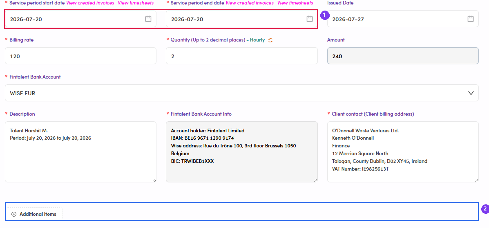
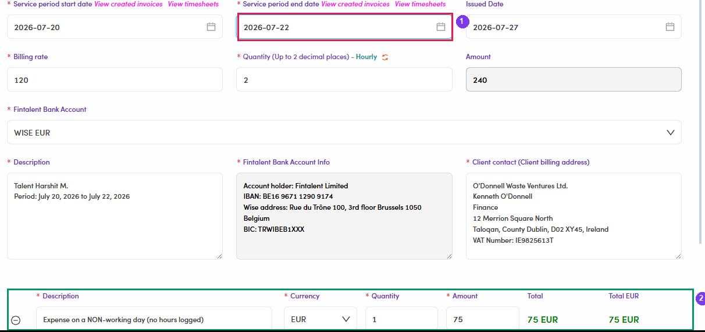

# B2.x.8 · Expense on a non-worked day

> B2 · Talent · log & submit timesheet → B2.x · Edge cases

**An expense dated on a day with no logged work → easily missed.** An expense reaches an invoice only if **the date on the expense** falls inside the invoice's **Service period** — and that period is **prefilled from the days that have submitted hours**. **Example:** the talent logs work on **Jul 20**, logs nothing on **Jul 22**, but files a **75 EUR** expense dated Jul 22. Admin creates the invoice → Service period prefills as **Jul 20 → Jul 20**, the total is just 2h × 120 = **240 EUR**, and **no expense line appears**. **The fix (Admin does this):** extend the **Service period end date** to cover the expense date — the item appears in the form immediately, with its own **Total**, and is added to the invoice. So the talent should **tell Admin/Ops in advance** when filing an expense on a day with no billable hours, so the date range gets widened at invoicing time.

| Situation | Result when Admin creates the invoice |
|---|---|
| Expense dated on a day **with** logged work | Included automatically, added straight to the total. |
| Expense dated on a day **without** logged work | **Does not appear** — the prefilled Service period never reaches that date. |

*B2.x.8a — ① the prefilled Service period covers only the day with logged work · ② Additional items is empty; the Jul 22 expense was not picked up.*

*B2.x.8b — ① end date changed to Jul 22 · ② the expense appears at once: 75 EUR.*
