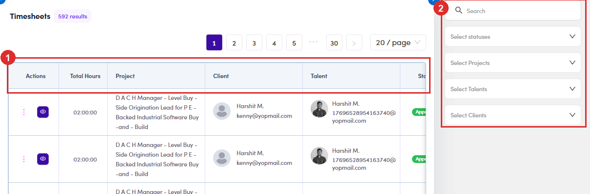
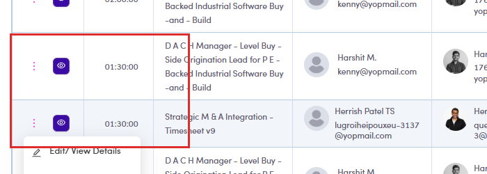
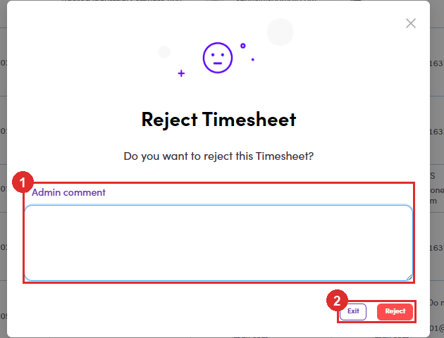
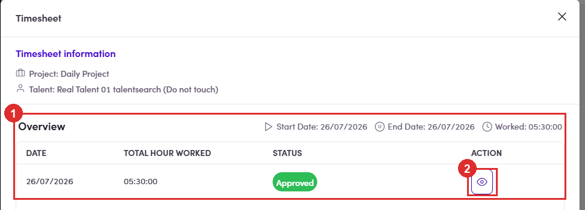
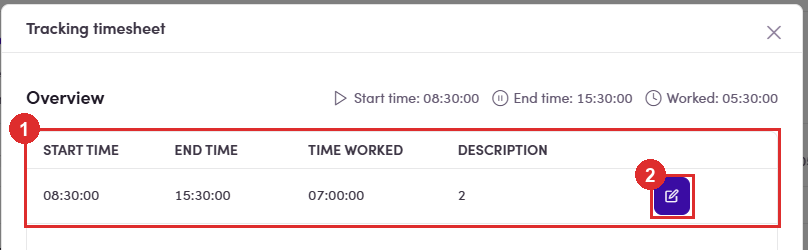
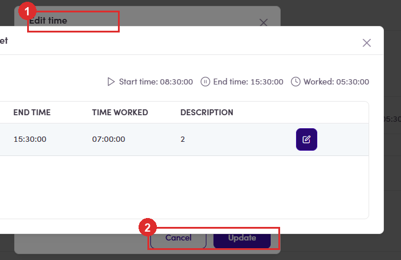

# B3.0 · Approve the submission

> B3 · Timesheet → invoice (Admin)

🐛 Nothing new ever arrives here, submissions approve themselvesWhen a talent submits, the record is created **already Approved**, and `approvedBy` is set to **the talent's own user id**, verified by submitting one and reading it straight back. `approvedDate` stays empty, so it is not going through the approve action either. Platform-wide: the only **Pending Approval** rows are from **January 2024**, and **Rejected is 0**. Nobody has ever rejected anything, because nothing has ever waited to be rejected. **The gate below is real and it works; it just never gets anything to hold.** Logged as **TS-09**. Until that changes, read this section as: *how to pull something back and review it deliberately*, not *your daily queue*.

This screen is not in the menu. You have to type the URL**/timesheet-submissions** (`https://admin.fintalent.io/timesheet-submissions`). It is a real, guarded admin page, 592 records, but nothing in the left menu links to it. If you have never seen it, that is why.

## B3.0.1 · What the page holds

One row per submitted period, titled **Timesheets**. Columns: **Actions**, **Total Hours**, **Project**, **Client**, **Talent**, **Status** and submit date. The panel on the right filters by **Search**, **statuses**, **Projects**, **Talents**, **Clients**. Statuses are **Pending Approval**, **Approved** and **Rejected**, the same three the talent sees, under different names ([B3.x.9 ↗](b3-x-9-talent-sees-different-words.md)).

*B3.0.1: ① the table · ② the filter panel.*

## B3.0.2 · The row menu changes with status

, the same way the Resources one does: **Switch to Pending is how you get anything into this queue at all.** Because submissions arrive approved, the only way to review one deliberately is to put it back to Pending yourself, then Approve or Reject it. It is also the undo if you approved something by mistake.

| Row is | ⋮ offers |
|---|---|
| **Pending Approval** | Edit/View Details · Switch to Draft · **Approve** · **Reject** |
| **Approved** | Edit/View Details · Switch to Draft · **Switch to Pending** |

*B3.0.2: a Pending Approval row: Approve and Reject only exist here.*

## B3.0.3 · Approve

→ *“Do you want to approve this timesheet?”* → **Yes**. That is the whole thing: no comment, no reason.

## B3.0.4 · Reject asks for a reason and will not proceed without one

The modal carries a required **Admin comment** box; the confirm button is red. Write something the talent can act on. This is the only thing they get back.

*B3.0.4: ① Admin comment, mandatory · ② the red Reject.*

## B3.0.5 · Check the hours before you decide

the **👁** in the Actions column opens the submission, and it goes three levels deep:

| Level | What you get |
|---|---|
| **Timesheet** | project, talent, start/end date, total worked, then one row per day with its own status. |
| **Tracking timesheet** (👁 on a day) | the individual time entries for that day, start time, end time, time worked, description. |
| **Edit time** (✎ on an entry) | **From**, **To** and **Description**, all editable, with **Update**. |

*B3.0.5: ① the day rows · ② the 👁 that opens one.*

*B3.0.5: ① the entries behind that day · ② the ✎ that edits one.*

## B3.0.6 · 🐛 Edit time opens, but you cannot use it

The dialog appears **underneath** the *Tracking timesheet* dialog that launched it, only its title and its buttons peek out, and **nothing in it can be clicked**: not the From or To fields, not Description, not even **Cancel** or **Update**. The two dialogs are stacked the wrong way round, *Tracking timesheet* sits in front of the **Edit time** box it just opened. Every click aimed at **Edit time** lands on the dialog covering it instead, which is why nothing responds. There is no way round it from the screen: close both and edit the entry from the timesheet row. **What to do instead:** press **Esc** to get out, and **Reject with a comment** ([B3.0.4 ↗](b3-0-approve-the-submission.md)) so the talent fixes and resubmits. **Do not tell a talent their hours have been corrected from this screen**, on this build, they cannot have been. If this is fixed, the reach is wider than you would expectThe control is offered on **Approved** submissions too, not only pending ones, and the talent is told their timesheet cannot be edited after submitting. Once it works, an edit here will be invisible to them, with no notification and no record of who changed what. Worth agreeing a rule before it goes live.

*B3.0.6: ① the Edit time title, poking out above · ② its Cancel and Update, poking out below. Everything between them is covered, and all of it is unclickable.*

## B3.0.7 · Only then move on

Approved hours are what B3.1 onwards works with. Sync Data and Create Client Invoice do not check this screen for you.
