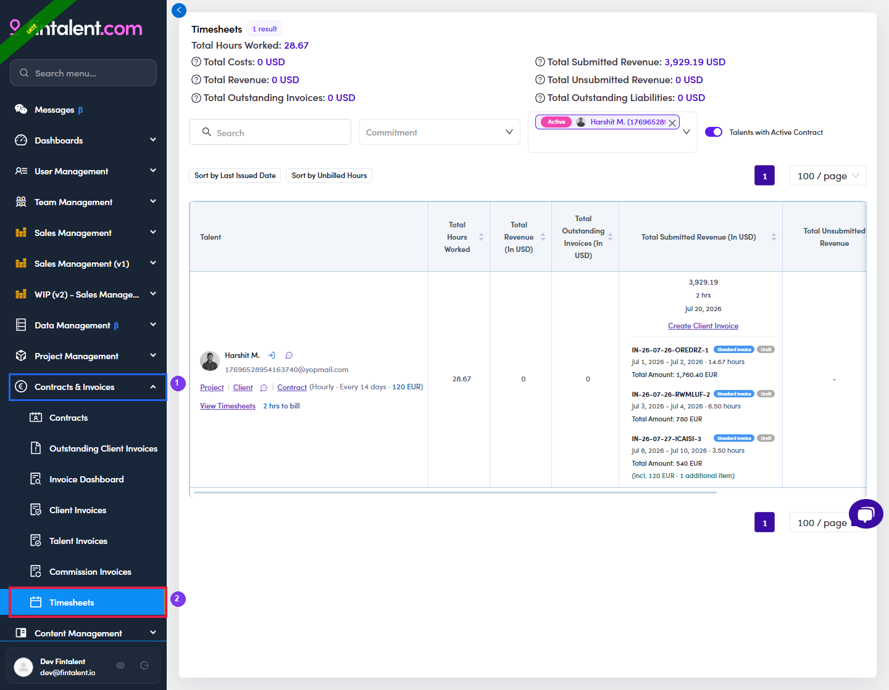
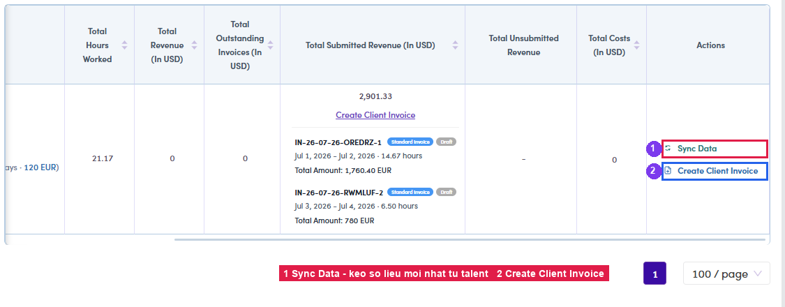

# B3.1 · View & Sync Data

> B3 · Timesheet → invoice (Admin)

1. **B3.1.1** — Left menu → **Contracts & Invoices** → **Timesheets**.

   

   *B3.1.1 — ① the Contracts & Invoices group · ② the Timesheets entry at the bottom of it.*

2. **B3.1.2** — **Filter down to the talent** with the **Select talents** box (type a name or email, then pick). Use the **Talents with Active Contract** toggle to see only people with a running contract.

   

   *B3.1.2 — ① the Select talents box with a talent chosen (Active chip + name).*

3. **B3.1.3** — Click **Sync Data** on the talent's row — this pulls in whatever the talent has just submitted.

   

   *B3.1.3 — ① Sync Data in the Actions column · ② Create Client Invoice.*

4. **B3.1.4** — **Read the talent's row** — three things decide what happens next:

   | What you see | What it means |
   |---|---|
   | **(Commitment · cycle · rate)** | e.g. *Hourly · Every 14 days · 120 EUR* — cross-check against the contract. |
   | **Unbilled: N h** | Hours **submitted but not yet invoiced** — exactly what is about to be billed. |
   | **“X hrs to bill · Y hrs worked”** | A **discrepancy warning**: shown only when the two differ. It comes with the **date range** that will go on the invoice. |

   

   *B3.1.4 — ① talent filter · ② contract (commitment · cycle · rate) · ③ View Timesheets · ④ Create Client Invoice · ⑤ invoice history (each block shows date range + hours + amount). This screenshot was taken after everything had been billed, so no Unbilled figure and no warning are visible — both appear only while hours remain uninvoiced.*
