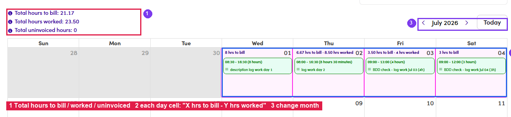
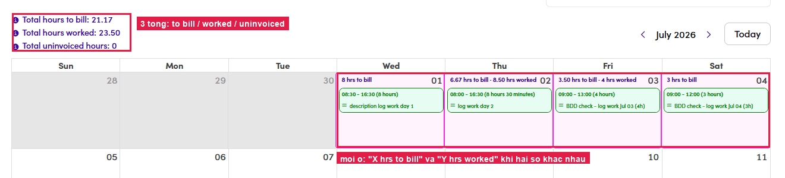

# B3.2 · View Timesheets

> B3 · Timesheet → invoice (Admin)

1. **B3.2.1** — Click **View Timesheets** on the talent's row → opens that talent's monthly calendar.

   

   *B3.2.1 — ① View Timesheets · ② invoices already created, shown on the same row.*

2. **B3.2.2** — **Reconcile the three totals** in the top left:

   | Figure | Must equal |
   |---|---|
   | **Total hours to bill** | the *submitted* total on the talent portal — the number the money follows. |
   | **Total hours worked** | the actual logged hours. |
   | **Total uninvoiced hours** | what has not been invoiced yet — matches **Unbilled** in [B3.1.5 ↗](b3-1-view-and-sync-data.md). |

   

   *B3.2.2–B3.2.3 — ① the three totals · ② each day cell reads “X hrs to bill · Y hrs worked” · ③ month navigation.*

3. **B3.2.3** — **Check the day cells.** A cell shows **“X hrs to bill”**; when that day was adjusted it shows **“X hrs to bill · Y hrs worked”**, along with the time range and the Note the talent wrote.

   

   *B3.2 — the three totals on top; each day cell shows both to bill and worked whenever they differ.*

4. **B3.2.4** — If the numbers agree, close this and move on to invoicing. If they do not, **stop** — check with the talent before billing.
