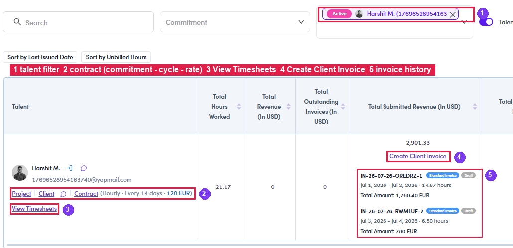
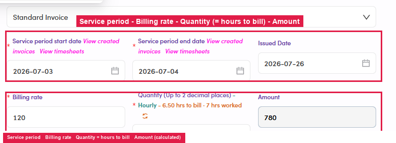
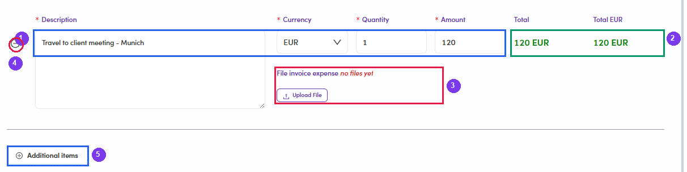

# B3.3 · Create Client Invoice

> B3 · Timesheet → invoice (Admin)

## B3.3.1

Click **Create Client Invoice** (on the talent's row in Timesheets, or via **Client Invoices → Create new Client Invoice**). The form opens empty — that is normalEven though you clicked from a specific talent's row, **nothing is filled in** and almost every field is **greyed out**. Only the **Contract** picker is active. Nothing happens until you choose a contract, so do that first and the rest of the form comes to life.

*B3.3.1 — ④ Create Client Invoice, right on the talent's row.*

## B3.3.2 · Pick the Contract — this is the step that fills the form

Above the picker sit two chips, **Active** and **Completed**, which decide **which contracts are offered**. A finished engagement still has hours to bill, so a **Completed** contract is a legitimate choice — just make sure it is the one you meant. One talent can hold several contracts at once, and they are listed by **commitment + project**, e.g. *Hourly Project* and *Daily Project* for the same person. Pick the wrong one and the rate, the unit and the currency all come out wrong — see [B2.x.5 ↗](b2-x-5-several-projects.md). **The moment you choose, a summary bar appears at the top of the form.** Read it before anything else — it is the fastest sanity check that you are billing the right work: The same bar carries five links — **View Timesheets · View Contract · View Project · View Talent · View Client** — so every cross-check can be done without abandoning the half-filled form.

| Row | What to check |
|---|---|
| **PROJECT** | the engagement being billed. |
| **CLIENT** | company name, billing address and VAT number. **Watch for a red *“Name is missing”* chip here** — the client record is incomplete, and that gap will print on the PDF. Fix the client record before creating the invoice. |
| **EMAIL** · **TALENT** | who the invoice goes to, and whose hours it bills. |
| **CONTRACT** | rate + commitment (*100 EUR / Hourly*), the bank account (*WISE EUR*), the **payment terms** (*Net 10*), the start date, and where the contract came from (*Pandadoc*). |

## B3.3.3 · Now check every prefilled field

The figures come from the contract and the uninvoiced timesheet range — prefilled is not the same as correct: **Four controls on this form that are easy to walk past:** The **“X hrs to bill · Y hrs worked”** warning is repeated right above **Quantity**, and the label states the hard limit: **up to 2 decimal places**. Read both one last time here.

| Field | Must be |
|---|---|
| **Contract / Project / Client** | the contract you are actually billing. |
| **Service period start / end** | the uninvoiced date range ([B3.1.5 ↗](b3-1-view-and-sync-data.md)). |
| **Issued Date** | defaults to today. |
| **Billing rate** | = the **billing rate** on the contract (what the client pays). |
| **Quantity** | **= hours to bill** (Hourly) or **= days to bill** (Daily) — **not** the logged hours. |
| **Amount** | calculated as Quantity × Billing rate. **Multiply it yourself as a check.** |
| **Currency · Fintalent Bank** | as per the contract (e.g. EUR → WISE EUR). |
| **Client billing address · VAT** | as per the contract. |
| **Description** | talent name + period, composed for you. |

| Control | What it is for |
|---|---|
| **File invoice (PDF)** → **Upload File** (top of the form) | Attach your **own** PDF for this invoice. Leave it empty and Fintalent generates the PDF itself ([B3.4 ↗](b3-4-review-invoice-and-pdf.md)). Do not confuse it with the **expense receipt** upload further down — different field, different document. |
| **↻** next to **Quantity** | Recalculates Quantity from the timesheets. Use it after changing the service period, instead of doing the arithmetic yourself. |
| **View created invoices** · **View timesheets** (links on the Service period labels) | Answer “has this range already been billed?” and “what is actually logged in it?” without leaving the form. |
| **Additional items** (bottom) | Add non-fee lines **while creating**, not only when editing afterwards. They appear on the invoice as *(incl. N additional items)*. |

*B3.3.3 — Service period · Billing rate · Quantity = hours to bill · Amount calculated.*

## B3.3.4 · Review the expense reports (if the talent filed any)

Expenses do **not** sit on the fee line — they land at the bottom of the form, one row each. Check each of them: To drop an invalid item from this invoice, click **⊖** at the start of its row; to add something beyond the fee, click **⊕ Additional items**. An expense the talent filed is missing?It falls outside the **Service period** — usually because the talent dated it on a day with no billable hours. Widen the date range and it appears: see [B2.x.8 ↗](b2-x-8-expense-on-a-non-worked-day.md).

| What to look at | Check against |
|---|---|
| **Description** | What the talent wrote — clear enough that the client understands what they are paying for. |
| **Currency** | Matches the contract currency. |
| **Quantity × Amount = Total** | Calculated; **Total EUR** is what actually joins the invoice. |
| **File invoice expense** | The receipt. *“no files yet”* means **the talent attached nothing** — ask for it before billing, or **Upload File** yourself if you received it another way. |

*B3.3.4 — ① Description · Currency · Quantity · Amount · ② Total EUR joining the invoice · ③ the receipt attachment (currently \*no files yet\*) · ④ drop this item · ⑤ add a new one.*

## B3.3.5

When everything checks out, click **Create**. The invoice is created in **Draft**, tagged **Timesheets (date range)** — review it straight away in [B3.4 ↗](b3-4-review-invoice-and-pdf.md). If there were expenses, the total already includes them.
