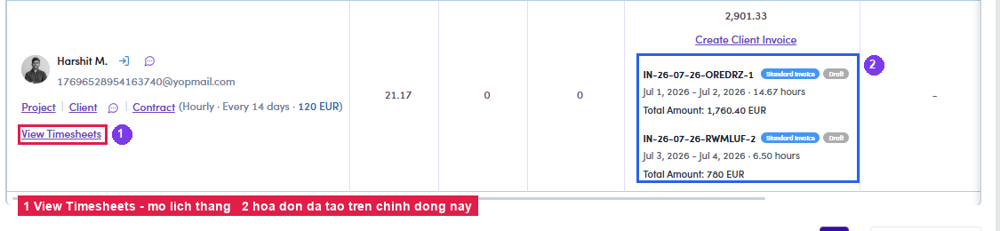
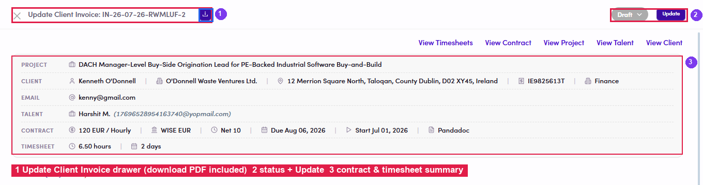
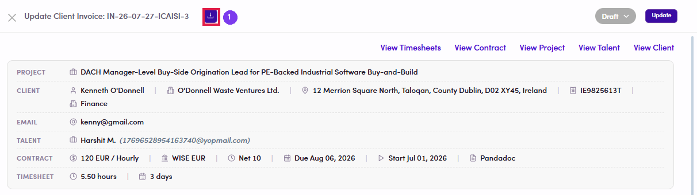
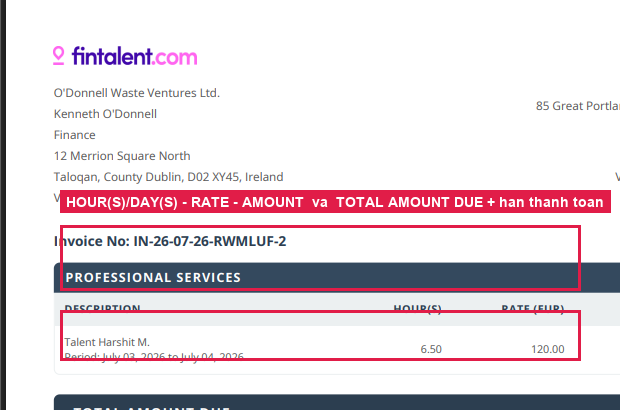
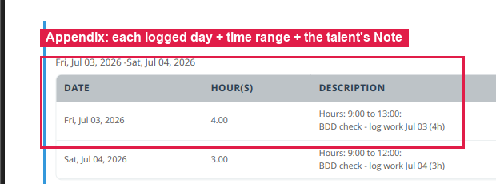

# B3.4 · Review invoice & PDF

> B3 · Timesheet → invoice (Admin)

## B3.4.1 · No need to leave the Timesheets page

Once created, go back to the list. The invoice appears **on that talent's own row**: number, type, **Draft** status, date range, hours and **Total Amount**. With expenses it also reads *“(incl. <amount> and N additional item)”*: that line alone tells you how many non-fee items are on the invoice, without opening it. Each billing round is one block, stacked in order.

*B3.4.1: ② the invoices created so far, shown directly on the talent row of the Timesheets page.*

## B3.4.2 · Click the invoice block

→ the **Update Client Invoice** drawer opens in place. It already contains: the **⤓ download PDF** button next to the title, the **status** dropdown + **Update**, the full editable form, and the links **View Timesheets, View Contract, View Project, View Talent and View Client**.

*B3.4.2: ① the drawer with its ⤓ download button · ② status + Update · ③ contract & timesheet summary.*

## B3.4.3 · Click ⤓

→ wait a few seconds and the **PDF opens in a new tab** (it is fetched from storage, not pushed through a download prompt). **The other route:** menu **Contracts & Invoices → Client Invoices** → find the invoice → the **Actions** column has **👁** (view detail) and **⤓** (download PDF), identical result. Use it when you need to search across many invoices and talents.

*B3.4.3: ① the ⤓ button sits right next to the invoice number, inside the detail drawer.*

## B3.4.4 · Page 1: the money

Cross-check: invoice number, client address + VAT, **HOUR(S)** (or **DAY(S)** on a Daily contract), **RATE**, **AMOUNT**, **TOTAL AMOUNT DUE**, the due date (from the contract's *Payment terms*) and bank details.

*B3.4.4: the fee line and TOTAL AMOUNT DUE with its due date.*

## B3.4.5 · Page 2: the timesheet appendix

Lists **every day** the talent logged, with time ranges and Notes. This is what shows the client the **actual work**.

> **Two numbers, two purposes**
>
> This appendix prints the **hours the talent logged**, so the client can see the real work. The **hours the money is calculated from are still *hours to bill*** on page 1. If the talent reduced the hours at submit time, the two pages will differ, and that is **by design**, see [B3.x.4 ↗](b3-x-4-the-two-pdf-pages-differ.md).

*B3.4.5: the appendix: each day + time range + the Note the talent wrote.*

## B3.4.6

If everything agrees, **go to the Issue Client Invoices flow**. If not, void or edit the invoice before sending it.
