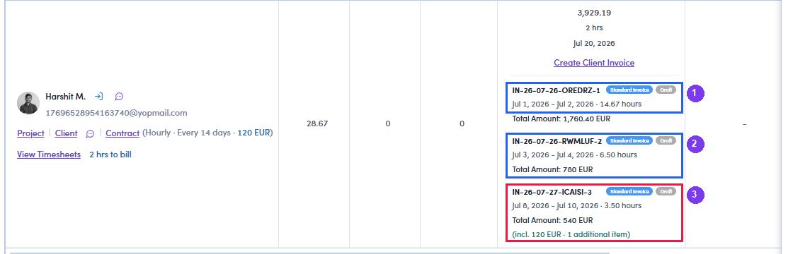

# B3.x.3 · Several billing rounds

> B3 · Timesheet → invoice (Admin) → B3.x · Edge cases

**Several billing rounds on one contract.** Each round takes only the **uninvoiced** part; days already on a previous invoice are never billed twice. The talent's row keeps the history of every invoice created, with its date range.

*B3.x.3 — three billing rounds on the same contract, stacked in order: ① Jul 1–2 · ② Jul 3–4 · ③ Jul 8–10 (this one also carries an expense).*
