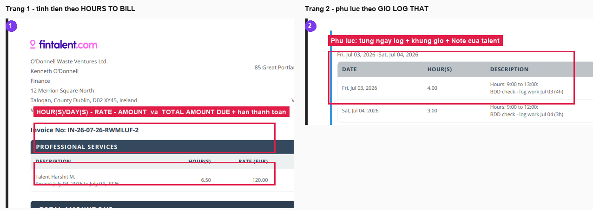

# B3.x.4 · The two PDF pages differ

> B3 · Timesheet → invoice (Admin) → B3.x · Edge cases

**The two PDF pages disagree — know this before a client asks.** Page 1 is calculated from **to bill**, page 2 lists the **actual logged hours** — so the two pages can show two different figures: The invoiced amount is **still correct** (it follows to bill). Whether an explanatory line should be added to the appendix is still open.

- **Hourly:** page 1 = 6.50 hours · page 2 = *Total Hour(s)* 7.00.

- **Daily:** page 1 = 1.50 days · page 2 = *Total Day(s)* 1.75 — **same unit on both pages, which is the most confusing case**.

*B3.x.4 — ① page 1 charges from hours to bill · ② page 2 lists the actual logged hours.*
