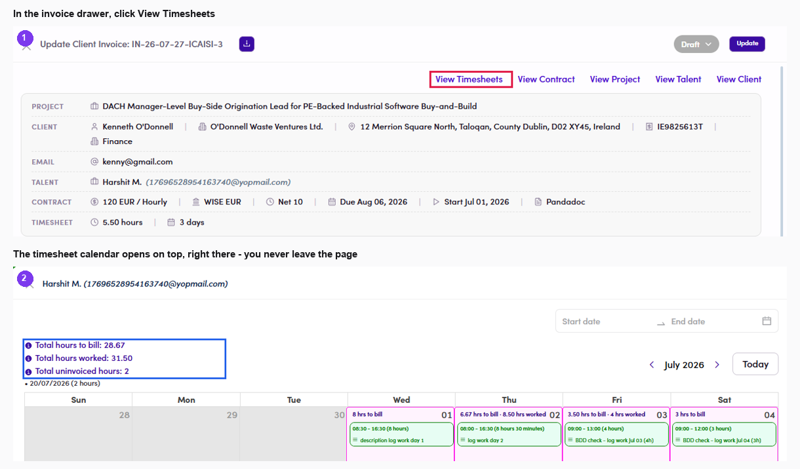

# B3.x.8 · Timesheets have changed

> B3 · Timesheet → invoice (Admin) → B3.x · Edge cases

**“Timesheets have changed, please check again”.** Seeing this on a **Draft** invoice means the **source timesheet changed** after the invoice was created — the talent submitted more days, or an admin pressed **Sync Data** and newer figures arrived. **Reconcile without leaving the invoice:** the link row at the top of the drawer includes **View Timesheets** — clicking it **opens the talent's timesheet calendar on top**, with all three totals (*hours to bill / worked / uninvoiced*) and every day cell. Closing it with **✕** returns you to the same invoice. **Opened this way the calendar gains a colour legend**, and it answers the "which days am I actually billing?" question at a glance: The legend appears **only** on the calendar opened from an invoice. The one opened with **View Timesheets** from the talent row in [B3.2 ↗](b3-2-view-timesheets.md) has no colours, because there is no "current invoice" to colour against. If they differ, correct the invoice and click **Update**. **Never send an invoice while this message is showing** — the figures on it may be stale.

| Cell colour | Meaning |
|---|---|
| **Pink** — *Current invoice* | days this invoice covers |
| **Orange** — *Other invoices* | days already billed on a different invoice — never billed twice, see [B3.x.3 ↗](b3-x-3-several-billing-rounds.md) |
| **White** | logged but on no invoice yet — this is what *uninvoiced hours* counts |

*B3.x.8 — ① the View Timesheets link inside the invoice drawer · ② the calendar opens on top, three totals ready to check against Service period and Quantity.*
