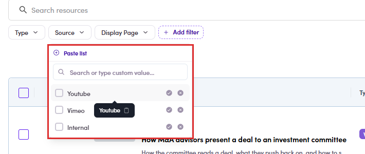
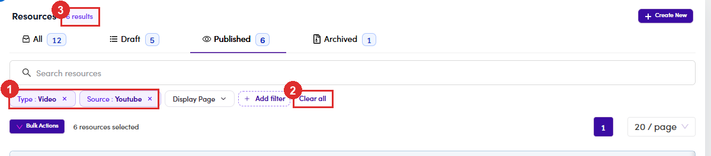

# B4.1 · Open Resources

> B4 · Publish a resource (Admin)

## B4.1.1

Left menu → **Content Management** → **Resources**. You can also go straight there with the URL **/resources** (`https://admin.fintalent.io/resources`).

*B4.1.1: the Resources entry under Content Management.*

## B4.1.2 · The four tabs are the status filter

, and each carries its own count. Everything you do to a resource for the rest of this flow moves it between them. Below the tabs: a keyword search, quick filters for **Type** and **Source**, and **Add filter** for **Display Page** and **Published Date**. The table shows **Information** (thumbnail, status chip, publish date, title, description), **Type**, **Source**, **Display Page** and **Categories**.

| Tab | Holds |
|---|---|
| **All** | every resource, whatever its status. |
| **Draft** | written but not released. **Talents cannot see these.** |
| **Published** | live. |
| **Archived** | retired. Also invisible to talents, but kept. |

> **Categories is a column, not a filter**
>
> You can read a resource's categories in the table but you cannot filter on them here. Talents can: their page has a Categories picker. If you need to audit by category, sort it out visually or ask on the talent side.

*B4.1.2: ① the four status tabs with their counts · ② how many rows the current tab is showing.*

## B4.1.3 · Narrowing the list

Four things sit above the table, and they do not all do the same job: **Each value has two ways in.** Hover a value and two circles appear on the right: **✓** keeps only that value, **✗** excludes it. So you can just as easily ask for “everything except Internal”. **What you picked shows as a chip** on the bar, *Type: Video*, *Source: Youtube*. Drop one with its **×**, or wipe the lot with **Clear all**. Filters stack, so those two together mean Youtube videos only.

| Control | What it does |
|---|---|
| **Status tabs** | the main split, All / Draft / Published / Archived, each with its own count. Everything below narrows *within* the tab you are on. |
| **Search resources** | free text over title and description. Filters as you type and moves the tab counts with it. |
| **Type** · **Source** · **Display Page** · **Published Date** | quick filters. Each opens a list of values with a checkbox, plus **Paste list** and a **Search or type custom value** box. |
| **Add filter** | **not a filter.** It opens **Customize Quick Filters**: tick which of the four get pinned to the bar. **Type** and **Source** are pinned by default; add the other two yourself. |

*B4.1.3: Source opened: the three values, the include / exclude circles on each row, and Paste list on top.*

*B4.1.3: ① the two chips, each removable on its own · ② Clear all · ③ the result count, down from 27 to 6.*

> **Filters do not survive a refresh, and the link is not shareable**
>
> They hold while you stay on the page, but reload and the chips are gone and the list comes back unfiltered. The address bar writes `?bResourceTypes=[object Object]` instead of the value, so **sending someone that URL sends them an unfiltered page**. If you need to hand over a specific set, say which filters to set rather than pasting a link.
