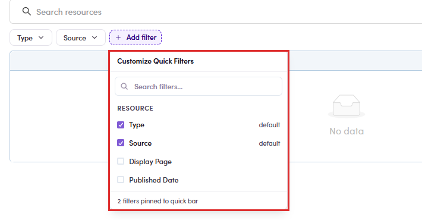
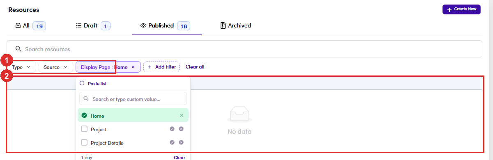

# B4.1 · Open Resources

> B4 · Publish a resource (Admin)

1. **B4.1.1** — Left menu → **Content Management** → **Resources**. It sits alongside **Weekly Calls** and **Configuration** — not under Project or User Management, which is where people look first. You can also go straight there with the URL **/resources** (on UAT: `https://admin-uat.fintalent.io/resources`).

   

   *B4.1.1 — the Resources entry under Content Management.*

2. **B4.1.2** — **The four tabs are the status filter**, and each carries its own count. Everything you do to a resource for the rest of this flow moves it between them. Below the tabs: a keyword search, quick filters for **Type** and **Source**, and **Add filter** for **Display Page** and **Published Date**. The table shows **Information** (thumbnail, status chip, publish date, title, description), **Type**, **Source**, **Display Page** and **Categories**. Categories is a column, not a filterYou can read a resource's categories in the table but you cannot filter on them here. Talents can — their page has a Categories picker. If you need to audit by category, sort it out visually or ask on the talent side.

   | Tab | Holds |
   |---|---|
   | **All** | every resource, whatever its status. |
   | **Draft** | written but not released. **Talents cannot see these.** |
   | **Published** | live. |
   | **Archived** | retired. Also invisible to talents, but kept. |

   

   *B4.1.2 — ① the four status tabs with their counts · ② how many rows the current tab is showing.*

3. **B4.1.3** — **Narrowing the list.** Four things sit above the table, and they do not all do the same job: The quick filters are broken right now — use the tabs and the search boxPick any value in **Type**, **Source** or **Display Page** and the page goes to **No data**, whatever you chose. The URL gives the fault away: it writes `?bResourceTypes=[object Object]` instead of the value. Checked on UAT with 4 published *Internal* videos in the data — filtering on **Source = Internal** still returned nothing. The **status tabs** and the **search box** work normally. Use those until this is fixed.

   | Control | What it does |
   |---|---|
   | **Status tabs** | the main split — All / Draft / Published / Archived. Each carries its own count. |
   | **Search resources** | free text over title and description. Types as you go and updates the tab counts with it. |
   | **Type** · **Source** | quick filters pinned to the bar. Each opens a checkbox list with an **include** (✓) and an **exclude** (✗) toggle per value, plus **Paste list** for bulk input. |
   | **Add filter** | **not a filter.** It opens **Customize Quick Filters** — tick which filters get pinned to the bar. Four exist: **Type**, **Source** (both pinned by default), **Display Page**, **Published Date**. |

   

   *B4.1.3 — ① the quick-filter bar · ② Source opened: three values, each with include / exclude, and Paste list on top.*

   

   *B4.1.3 — Add filter only pins and unpins. Display Page and Published Date are the two you have to add yourself.*

   

   *B4.1.3 — ① a value picked in the quick-filter bar · ② the table empties out; the address bar reads `[object Object]`.*
