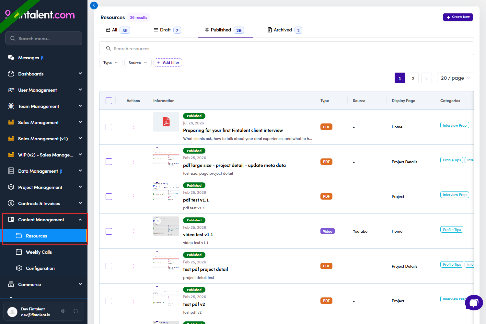
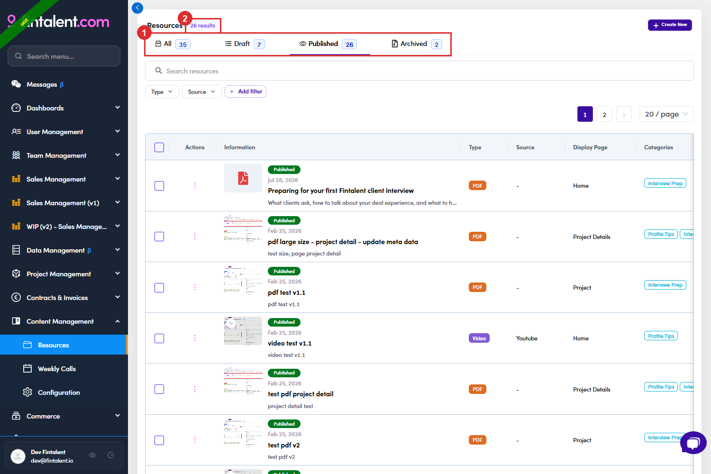

# B4.1 · Open Resources

> B4 · Publish a resource (Admin)

1. **B4.1.1** — Left menu → **Content Management** → **Resources**. It sits alongside **Weekly Calls** and **Configuration** — not under Project or User Management, which is where people look first.

   

   *B4.1.1 — the Resources entry under Content Management.*

2. **B4.1.2** — **The four tabs are the status filter**, and each carries its own count. Everything you do to a resource for the rest of this flow moves it between them. Below the tabs: a keyword search, quick filters for **Type** and **Source**, and **Add filter** for **Display Page** and **Published Date**. The table shows **Information** (thumbnail, status chip, publish date, title, description), **Type**, **Source**, **Display Page** and **Categories**. Categories is a column, not a filterYou can read a resource's categories in the table but you cannot filter on them here. Talents can — their page has a Categories picker. If you need to audit by category, sort it out visually or ask on the talent side.

   | Tab | Holds |
   |---|---|
   | **All** | every resource, whatever its status. |
   | **Draft** | written but not released. **Talents cannot see these.** |
   | **Published** | live. |
   | **Archived** | retired. Also invisible to talents, but kept. |

   

   *B4.1.2 — ① the four status tabs with their counts · ② how many rows the current tab is showing.*
