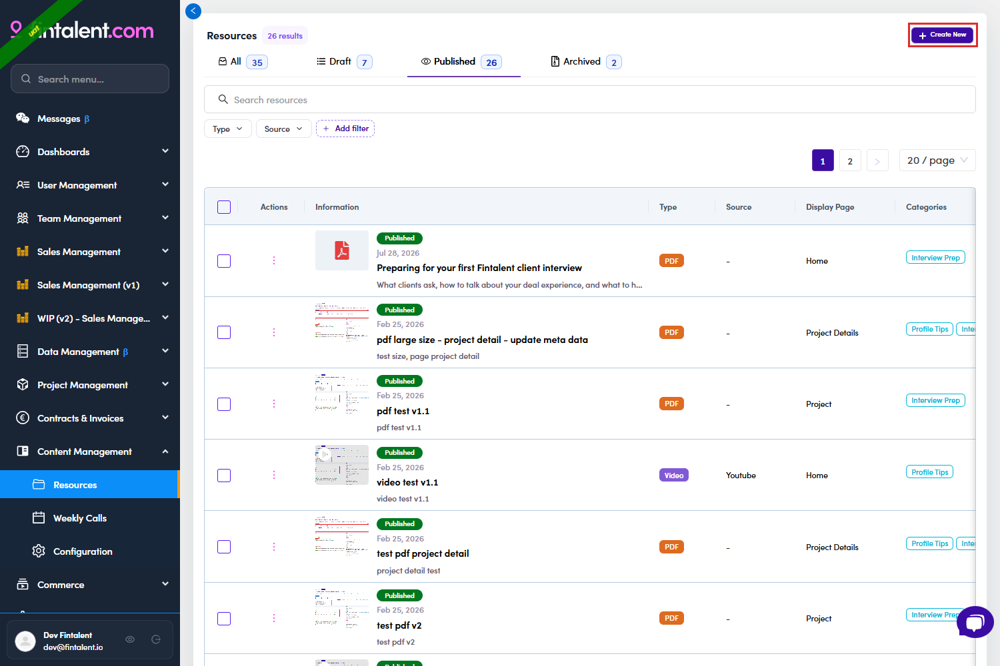
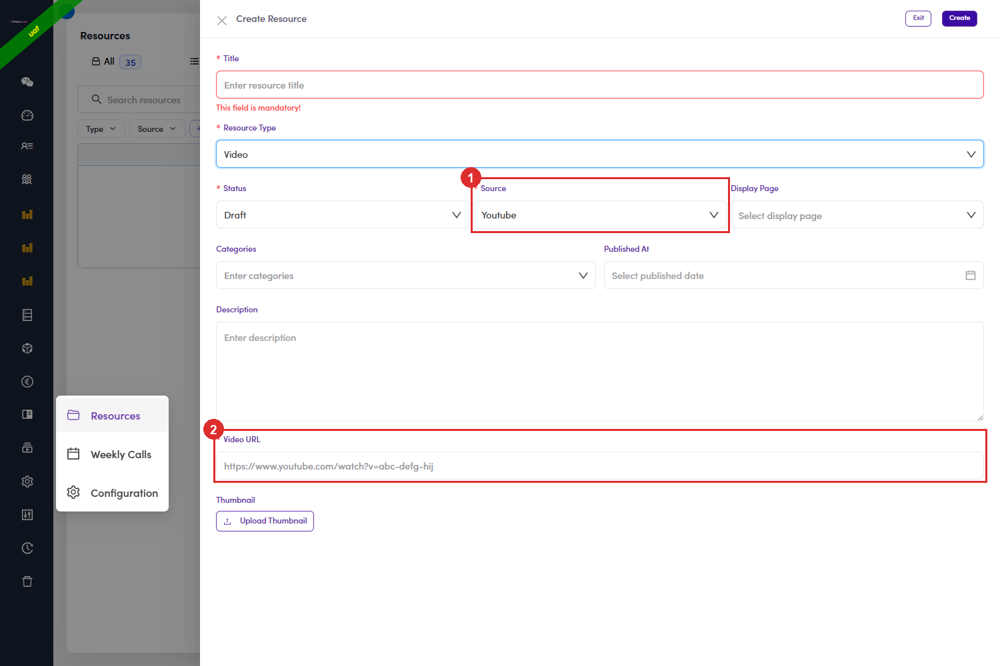
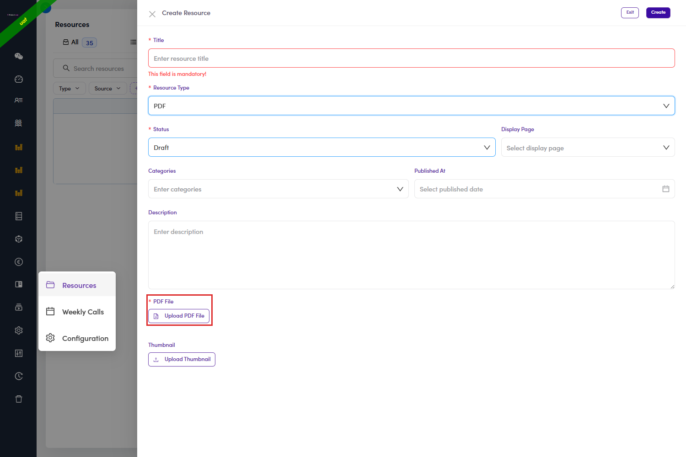
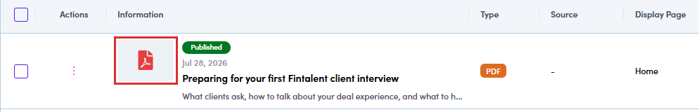
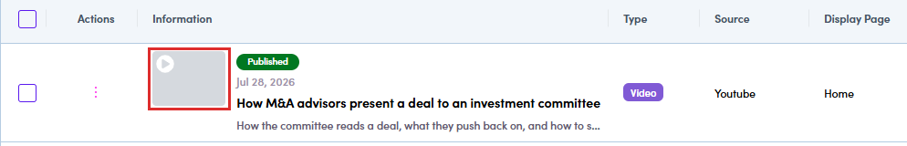
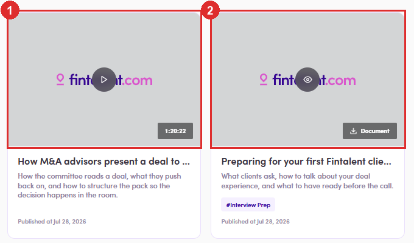

# B4.2 · Create one

> B4 · Publish a resource (Admin)

Click **Create New**, top right. A drawer opens over the list. Then work **down the form in order**, because the second field changes what the rest of it looks like.

*B4.2: Create New.*

> **You only have to fill in the required fields**
>
> Those are the ones carrying a ***** next to the label, and the form will not let you create the resource until each of them has something in it. Leave one empty and it turns red with *This field is mandatory* under it. **Everything else is optional and you can skip it.** The list below walks the whole form, required and optional together, so you can see what each field does before you decide whether you need it.

## B4.2.1 · Title

**required**. This is what a talent reads on the card, so write it for them, not for the file.

## B4.2.2 · Resource Type

**Video** or **PDF**. **Set this before anything else.** It decides which fields exist below, and once the resource is saved you cannot change it ([B4.x.3 ↗](b4-x-3-type-is-locked-after-saving.md)).

| Type | What appears |
|---|---|
| **Video** | **Source** (required) + **Video URL** (required) |
| **PDF** | Source and Video URL **disappear**; **Upload PDF File** takes their place, required |

*B4.2.2: the two fields only Video has: ① Source · ② Video URL.*

*B4.2.2: switch to PDF and Upload PDF File replaces them.*

## B4.2.3 · Source

(Video only): where the video comes from. It changes what you have to supply:

| Source | What you do |
|---|---|
| **Youtube** | paste the video link into **Video URL**. |
| **Vimeo** | same: paste the link into **Video URL**. |
| **Internal** | **upload a video file from your own machine.** **Play it back in the drawer before you press Create**. That is the only moment you can catch the wrong file, and Resource Type is locked afterwards. |

## B4.2.4 · Status

what happens the instant you press **Create**. Default is **Draft**. Nothing here is one-way: all three statuses can be swapped later from the row menu ([B4.5 ↗](b4-5-edit-draft-archive.md)).

| Status | The moment you press Create |
|---|---|
| **Draft** | **Not on the talent portal.** Safe: keep editing, publish when you are happy. |
| **Published** | **Live immediately.** Talents can see it as soon as the drawer closes, so be sure it is right first. You can still edit it or change status afterwards. |
| **Archived** | **Not on the talent portal.** Goes to storage. Still editable, and you can move it back out. |

## B4.2.5 · Display Page

which talent screen also gets a block with this resource on it. Optional. **Leave it blank and nothing breaks:** the resource still shows up on the talent **Resources** tab like everything else. It just does not get an extra placement anywhere. Full breakdown of the three values in [B4.3 ↗](b4-3-decide-where-it-shows.md).

## B4.2.6 · Categories

how the resource is classified. Two values exist: **Profile Tips** and **Interview Prep**. You may leave it empty, pick one, or pick both. Worth filling in: **this is the only field a talent can filter on** in their Resources tab ([B5.2 ↗](b5-2-the-resources-page.md)). Empty means harder to find, not just untidy.

## B4.2.7 · Published At

the day the resource is meant to go live **on its own**, so you can line something up in advance instead of coming back to publish it by hand. The date does still hold back something that is **already Published**: put a future date on a published resource and talents cannot see it until that day. Worth knowing if a resource reads Published but nobody can find it, see [B4.x.1 ↗](b4-x-1-published-but-nobody-sees-it.md).

> **It does not do that at the moment, so skip the field**
>
> A **Draft** with a future date stays a Draft. There is no *Scheduled* status and nothing flips it over when the day arrives, and there are Drafts carrying dates well in the past that are still Drafts. **Leave Published At empty and publish by hand when you want it live.** Either set **Status** to **Published** on this form (**B4.2.4** above), or change the status from the resource list ([B4.5 ↗](b4-5-edit-draft-archive.md)). Publishing fills the date in for you.

## B4.2.8 · Description

a line or two under the title on the card. Optional; the card renders fine without it.

## B4.2.9 · Thumbnail

the picture on the card. Optional, and **what you get when you skip it is not the same everywhere**:

| Left blank on… | Admin list | Talent card |
|---|---|---|
| **PDF** | a red **PDF icon** | plain grey **fintalent.com** placeholder |
| **Video**, any source | grey box with a **▶** | plain grey **fintalent.com** placeholder |

> **A Youtube or Vimeo link does not bring its own picture**
>
> The video's own cover image is never pulled in, so the card shows a placeholder instead. **Upload a thumbnail yourself.**

*B4.2.9: PDF, no thumbnail: the admin table falls back to a PDF icon.*

*B4.2.9: Video (Youtube), no thumbnail: a grey box with a play symbol, not the Youtube cover.*

*B4.2.9: the same two on the talent side: ① the video · ② the PDF. Identical placeholder; only the badge tells them apart.*
