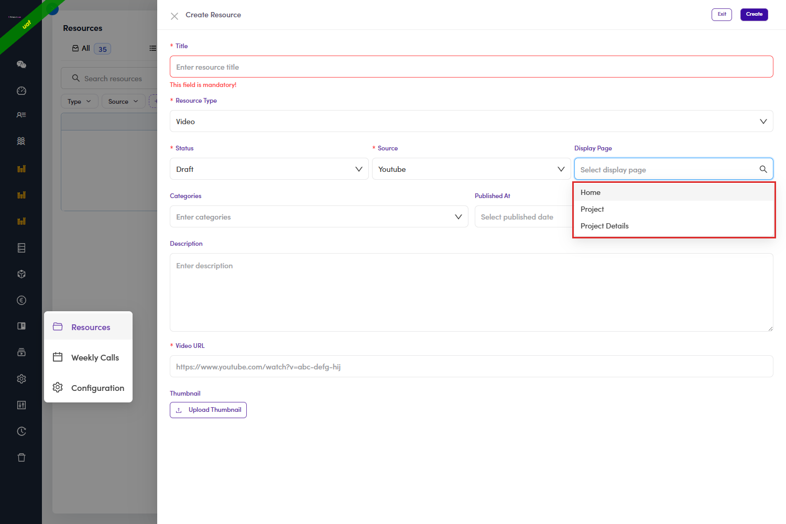

# B4.3 · Decide where it shows

> B4 · Publish a resource (Admin)

## B4.3.1 · Display Page

has three values, and each one puts a block on a different talent screen. This is the field people skip.

*B4.3.1 — the three values: Home, Project, Project Details.*

## B4.3.2 · What each one does

all three were checked against live counts on UAT: Every block is split **Videos (n) / Documents (n)** and scrolls as a carousel. See all three in [B5.4 ↗](b5-4-where-the-blocks-appear.md). It is not a filter on the Resources pageDisplay Page does not restrict who finds the resource. A published resource appears on the talent **Resources** page regardless — Display Page only adds the extra placement. Leaving it blank is allowed and simply means “Resources page only”.

| Display Page | Puts a **Resource** block on |
|---|---|
| **Home** | the talent's **Home** page, low in the left column, under the standing FAQ cards. |
| **Project** | the **project list** (*Work*), at the bottom of the filter sidebar. |
| **Project Details** | a **single project's** page, top of the right column. |
