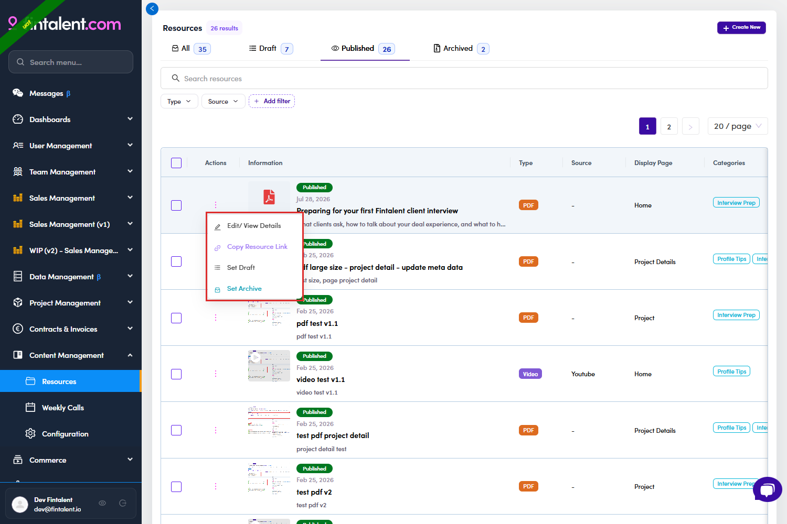
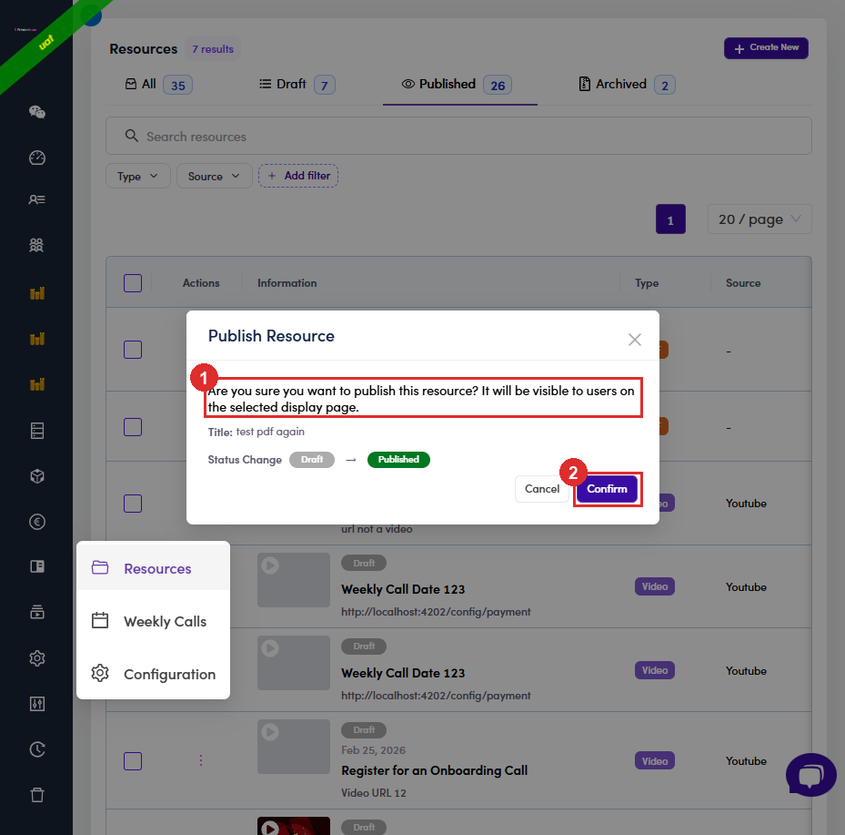

# B4.4 · Publish it

> B4 · Publish a resource (Admin)

## B4.4.1 · Status defaults to Draft

, so a resource you just created is invisible to talents until you say otherwise. You can publish from inside the drawer (set **Status** → **Published**) or later from the row menu.

## B4.4.2

From the list: row **⋮** → **Set Publish**. The menu always offers the **two statuses the resource is not currently in**, so what you see depends on the row:

| Row is | Menu offers |
|---|---|
| Draft | Edit/View Details · Copy Resource Link · **Set Publish** · **Set Archive** |
| Published | Edit/View Details · Copy Resource Link · **Set Draft** · **Set Archive** |
| Archived | Edit/View Details · Copy Resource Link · **Set Draft** · **Set Publish** |

*B4.4.2: the row menu on a Published row: the two moves offered are Set Draft and Set Archive.*

## B4.4.3 · Confirm

The dialog names the resource, shows the status change as chips, and tells you what publishing means, *“It will be visible to users on the selected display page.”* If you left Display Page empty, read that as the Resources page.

*B4.4.3: ① what publishing does · ② Confirm.*

## B4.4.4 · Publishing stamps *Published At* for you

verified: a Draft with no date came back with the date and time of the confirm. That date then shows in the **Information** column and on the talent's card. It matters more than it looks: see [B4.x.1 ↗](b4-x-1-published-but-nobody-sees-it.md).
