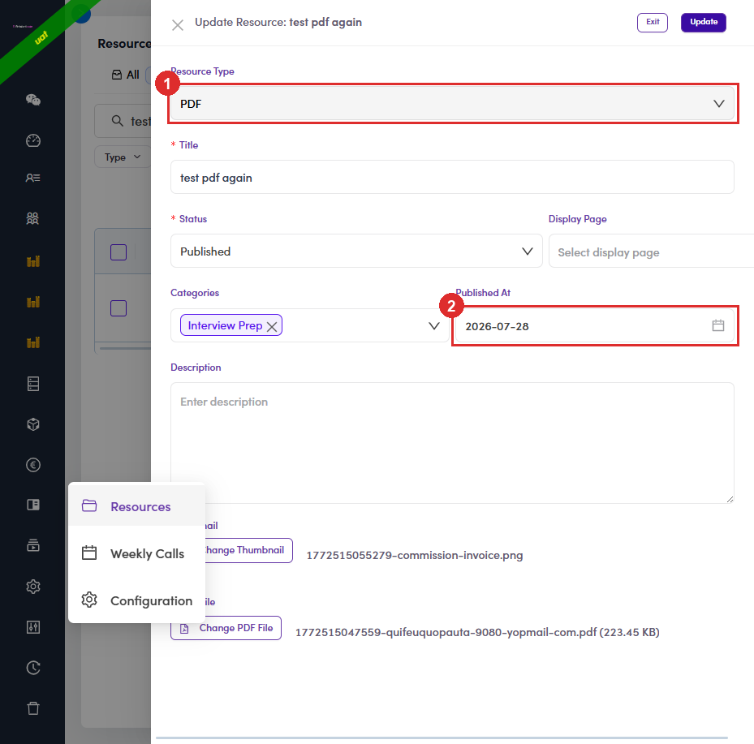
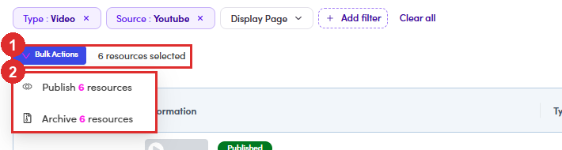

# B4.5 · Edit, draft, archive

> B4 · Publish a resource (Admin)

## B4.5.1 · Edit

click the title, or **⋮** → **Edit/View Details**. Same drawer, retitled **Update Resource: <title>**, and the button now reads **Update**. Two things differ from Create: **Resource Type is greyed out**, and **Published At** is already filled.

*B4.5.1: ① Resource Type, locked · ② Published At, stamped at publish.*

## B4.5.2 · Swap the file without recreating the resource

The drawer shows the stored filename and a **Change PDF File** / **Change Thumbnail** button. Use this to correct a bad upload. The resource keeps its link, its date and its place.

## B4.5.3 · Pull it back

**Set Draft** hides it from talents while you fix it; **Set Archive** retires it for good. Both are reversible, and neither destroys anything.

## B4.5.4 · Copy Resource Link

puts the file's own URL on your clipboard, handy for pasting into an email.

## B4.5.5 · Change a whole batch at once

Tick the checkbox in the table header (or individual rows) and a bar appears above the table: **Bulk Actions**, a running **N resources selected**, and, when your selection is a full page, **Select all N resources** to take the rest of the filtered set with it. **There is no bulk Set Draft**: pulling things back out of Published is one row at a time. Pairs with [B4.1.3 ↗](b4-1-open-resources.md): filter down to exactly the set you mean, tick the header box, act once.

| Bulk Actions offers | Note |
|---|---|
| **Publish N resources** | same effect as publishing each one by hand. |
| **Archive N resources** | the batch equivalent of Set Archive. |

*B4.5.5: ① the selection bar with the running count · ② the two actions, each naming how many rows it will touch.*
