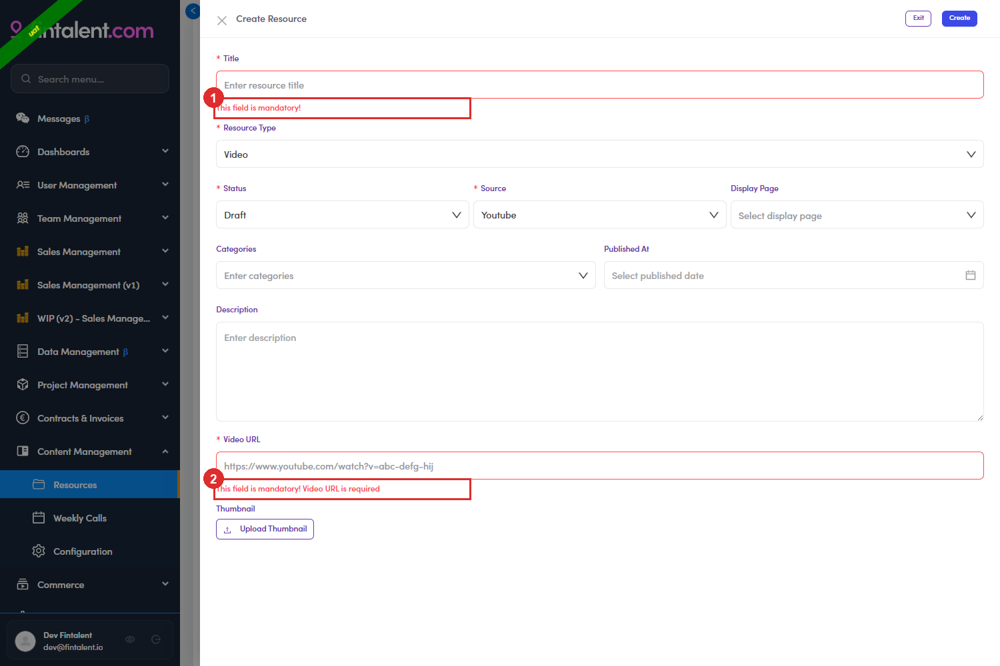

# B4.x.5 · Errors arrive one at a time

> B4 · Publish a resource (Admin) → B4.x · Edge cases

**Validation does not always show you everything at once.** On a **Video**, an empty form flags **Title** and **Video URL** together. On a **PDF** the file check comes second — submit an empty form and you only get *This field is mandatory!* under Title; fill the title in, submit again, and only then does **PDF File is required** appear. Fix, resubmit, and re-read the form rather than assuming the first pass listed everything.

*B4.x.5 — a Video form submitted empty: ① Title · ② Video URL, both flagged in the same pass.*
