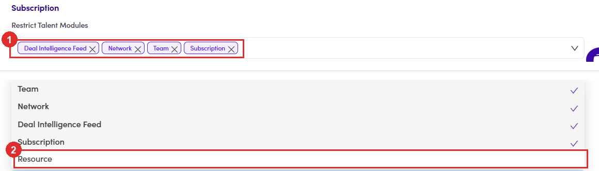

# B4.x.5 · Kill switch for the whole platform

> B4 · Publish a resource (Admin) → B4.x · Edge cases

**One switch turns Resources off for the whole platform.** **Config Management → Payment Config → Subscription → Restrict Talent Modules** is a multi-select, and **Resource** is one of the choices. Add it and every talent loses the menu entry and all five blocks at once, nothing about the resources themselves changes, so the admin list will look perfectly healthy while the talent side is dark. The field currently holds **Deal Intelligence Feed, Network, Team and Subscription**, and **Resource is not among them**. If Resources ever go missing for everyone at once, look here first.

*B4.x.5: ① the four modules currently switched off · ② Resource, the unticked fifth option. Ticking it turns the whole feature off.*
