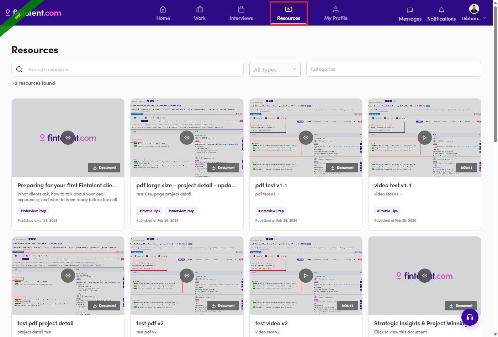
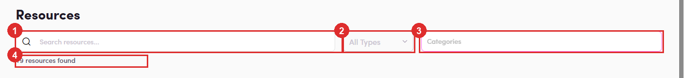
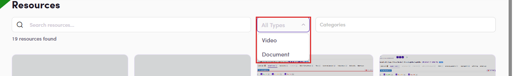

# B5.2 · The Resources page

> B5 · Talent · find a resource

## B5.2.1 · Resources

in the top navigation (bottom bar on a narrow screen).

*B5.2.1 — the Resources entry.*

## B5.2.2 · Three controls and a live count

They stack: set two and you get the intersection, and the count under them always tells you how many cards survived. Unlike the admin side, **these actually work** — compare [B4.1.3 ↗](b4-1-open-resources.md). A resource with no Categories can only be reached by search, never by the Categories filter.

| Control | How it behaves |
|---|---|
| **Search resources…** | free text, filters as you type — no button to press. Matches **title and description**, so a word from the summary finds it too. |
| **All Types** | single choice: **Video** or **Document**. “All Types” is the reset. |
| **Categories** | **multi-select** — **Profile Tips** and **Interview Prep**, the field admins set at [B4.2.6 ↗](b4-2-create-one.md). Chosen values sit in the box as chips; click the **×** on a chip to drop just that one. |
| **N resources found** | the honest number of cards below. Quickest check that something you published has gone live. |

*B5.2.2 — ① Search · ② All Types · ③ Categories · ④ the count.*

*B5.2.2 — All Types opened: only Video and Document.*

## B5.2.3 · Read a card

Thumbnail with **▶** for video or **👁** for document; a **⬇ Document** chip on PDFs or a **duration badge** on videos; then title, description, **#category** chips and **Published at <date>**. Cards whose thumbnail is a plain Fintalent placeholder are ones nobody uploaded an image for.
