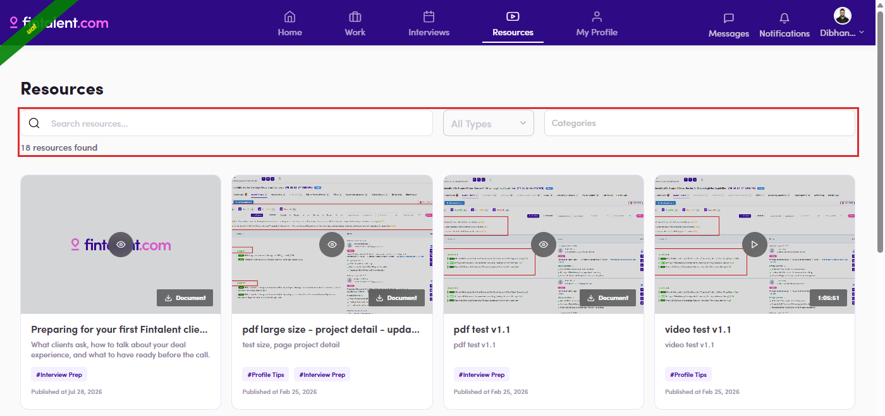

# B5.2 · The Resources page

> B5 · Talent · find a resource

1. **B5.2.1** — **Resources** in the top navigation (bottom bar on a narrow screen).

   

   *B5.2.1 — the Resources entry.*

2. **B5.2.2** — **Three controls and a count**: free-text **Search**, **All Types** (video / document) and **Categories** — the field admins fill in at [B4.2.4 ↗](b4-2-create-one.md). The count under them is the honest number of cards, so it is the quickest check that a change has gone live.

   

   *B5.2.2 — the filter row and the result count.*

3. **B5.2.3** — **Read a card.** Thumbnail with **▶** for video or **👁** for document; a **⬇ Document** chip on PDFs or a **duration badge** on videos; then title, description, **#category** chips and **Published at <date>**. Cards whose thumbnail is a plain Fintalent placeholder are ones nobody uploaded an image for.
