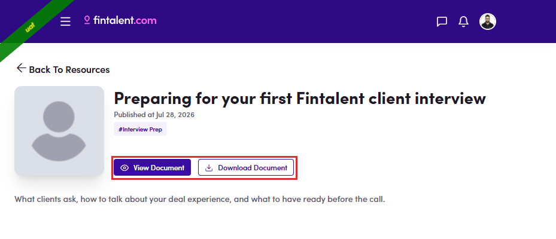

# B5.3 · Open one

> B5 · Talent · find a resource

## B5.3.1

Clicking a card opens its own page — **← Back To Resources**, the title, the published date, the category chips and the description. **What you can do there depends on the type**:

| Type | Actions |
|---|---|
| **PDF** | **👁 View Document** and **⬇ Download Document** |
| **Video** | **▶ Watch Video** — nothing else |

*B5.3.1 — a PDF: View Document and Download Document side by side.*
