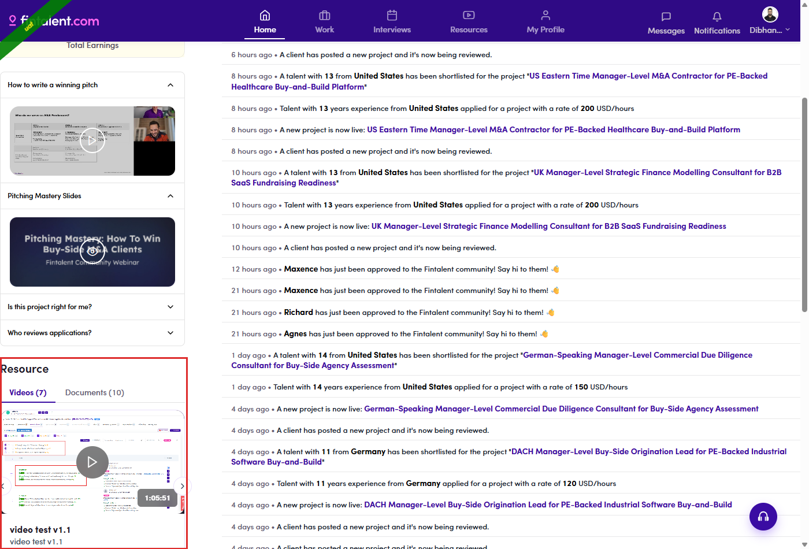
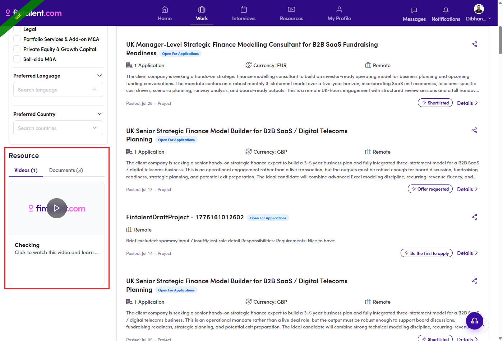
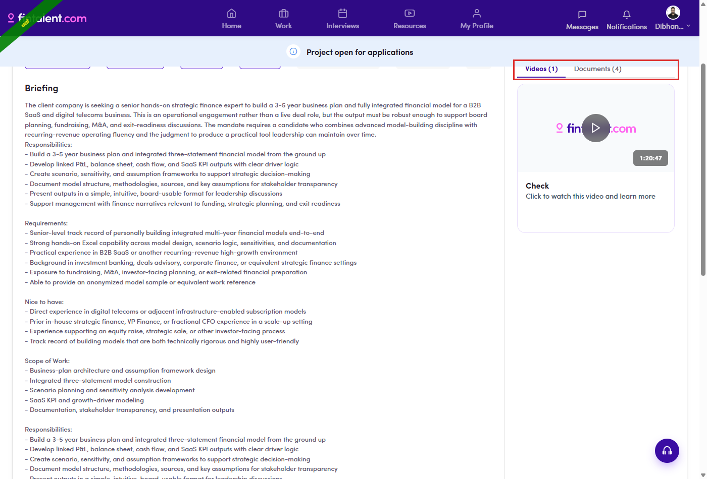

# B5.4 · Where the blocks appear

> B5 · Talent · find a resource

## B5.4.1 · There are exactly five places

a **Resource** block can be rendered, and no others. All five are the same component with a different **Display Page** passed in, so a resource never appears somewhere its Display Page does not name. Two different Home pages, same URL**/overview** renders one of two layouts and the block moves column between them. A talent with **Deal Intelligence Feed** access gets layout 2 (right column, plural heading); everyone else gets layout 1 (left column, singular heading). Same resource, different place — so “it is not on my Home page” may just mean the other layout.

| # | Screen | Display Page | Where on the screen |
|---|---|---|---|
| 1 | **Home** — standard layout | Home | **left** column, below the FAQ cards. Heading reads **Resource**. |
| 2 | **Home** — deal-intelligence layout | Home | **right** column, below Recent deal activity / Weekly deal calls / Boutique network. Heading reads **Resources**. |
| 3 | **Project list** (*Work*) | Project | bottom of the filter sidebar, past *Preferred Country*. |
| 4–5 | **Project detail** | Project Details | in the apply / CTA panel of the right column. Two layout variants exist in the code; **only one renders**, so you see a single block. |

## B5.4.2 · Home

the block sits under the standing FAQ cards. Do not confuse it with those: *How to write a winning pitch* and the rest are fixed page content, not resources, and no admin setting moves them.

*B5.4.2 — Display Page = Home, standard layout.*

## B5.4.3 · Project list

the bottom of the filter sidebar under **Work**.

*B5.4.3 — Display Page = Project.*

## B5.4.4 · Project detail

top of the right column, beside the briefing.

*B5.4.4 — Display Page = Project Details.*
