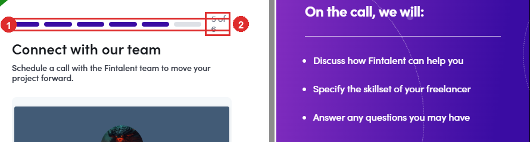
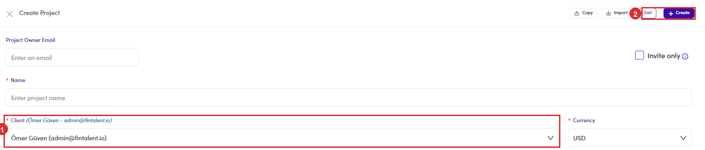

# C1.0 · Where a project comes from

> C1 · Approve a new project

**Two doors, and they behave differently.** Most projects arrive through the client, and those are the ones the queue is built for. Admins can also create one directly, which skips everything the client route does.

## Door 1: the client fills in a brief

A client who signs up lands in a **six-step wizard** and **cannot leave it**. Every other address in the client app redirects back until the wizard is finished, so a client mid-signup has no dashboard, no project list, nothing.

*C1.0: ① the six steps · ② where this client has reached. Step 5 is Connect with our team, a call booking.*

**The brief they fill in is much shorter than yours.** Five fields, and that is the whole thing the sourcing is built on:

| Field | Options |
|---|---|
| **Your Hiring Need** | Hire a talent · Hire a team |
| **Year of experience** | Analyst (1 to 2) · Associate (3 to 5) · Manager (6 to 10) · Senior (10+) |
| **Work location** | Onsite · Remote · Hybrid |
| **Required Languages** | English, and any others they add |
| **Project Brief** | free text, **100 characters minimum** |

The button at the bottom reads **Save to Submit project**, and that is the moment it reaches you.

> **The project record exists before anybody submits anything**
>
> Starting the wizard creates the record straight away, named **FintalentDraftProject - <timestamp>**. It sits in **Draft** carrying a red **UNPAID PROJECT POST FEE** badge. **That is what the Draft tab is**, near enough. Counted in one snapshot, the first twenty rows were all *FintalentDraftProject* and all unpaid, out of 93. So **Draft is not a queue of nearly-finished briefs.** It is mostly people who started, did not pay, and left. Nothing there needs your attention until it moves.

## Door 2: an admin creates it directly

**Projects → Create New** opens the full form, and it asks for a great deal more than the client does: **Name**, **Client**, **Currency**, **Summary**, **Client looking for**, **Work Location**, **Experience**, **Duration**, **Commitment**, **Seniority Level**, **Maximum Hires** and **Timezone** are all required. **Budget**, **Project Owner Email**, **Scope of Work**, language rules and the country and timezone restrictions are optional on top.

*C1.0: ① the Client field, pre-filled with your own admin account · ② Create.*

> **Client defaults to you, and nothing warns you**
>
> The field arrives holding the admin account you are signed in as. Create without changing it and you have made a project that belongs to Fintalent rather than to a client, which is wrong everywhere it matters later: contracts, invoices, and who can see it. **Set the client first, before anything else on the form.**

**Clone Project**, next to Create New, is the third way in. It copies an existing brief so a repeat mandate does not have to be typed again.

## The whole lifecycle, in order

Where this sits in the operations matrix: everything above **In Review** is the client's own onboarding, **6.0 New Project Intake & Qualification** is the Approve decision in [C1.3](c1-3-approve-or-archive.md), and everything after **Open** is **5.0**, **4.0** and then the four monitoring processes in [C4 ↗](c4-keep-the-pipeline-moving.md).
