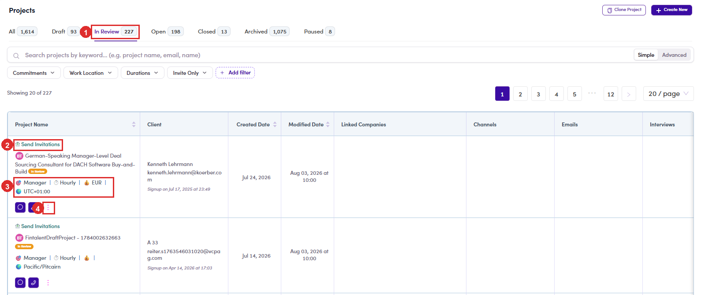

# C1.1 · The In Review queue

> C1 · Approve a new project

**Project Management → Projects.** The tabs across the top are the whole lifecycle, and each carries a live count.

| Tab | What is in it |
|---|---|
| **Draft** | the client started writing and has not sent it. |
| **In Review** | **your queue.** Sent in, waiting on a decision. |
| **Open** | approved and live. Talents can see it and apply. |
| **Paused** | stopped for now, not finished. |
| **Closed** | finished. |
| **Archived** | put away. By far the biggest tab. |

*C1.1: ① the In Review tab, your queue · ② Send Invitations, which jumps straight to sourcing · ③ what the client asked for, at a glance · ④ the ⋮ row menu.*

Every row already tells you the shape of the job without opening it: **seniority**, **rate type**, **currency** and **timezone**, with the client and their signup date beside it.
