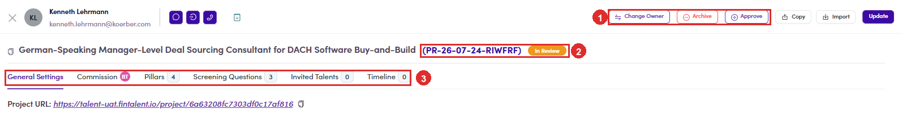

# C1.2 · Read the brief

> C1 · Approve a new project

Click the project name, or use the **⋮** menu and pick **Tab General Settings**. A drawer opens over the list.

*C1.2: ① the three decisions · ② the project code and its status · ③ the tabs, where the rest of the brief lives.*

| Tab | What to check |
|---|---|
| **General Settings** | the brief itself: **Summary**, **Client looking for**, **Work Location**, **Experience**, **Budget**, **Duration** and **Commitment**. |
| **Commission** | what Fintalent earns on it. |
| **Pillars** | the skills the match will be scored against. This is what drives the fit score later ([C3.2 ↗](c3-2-fit-score-and-evidence.md)). |
| **Screening Questions** | what every applicant will be asked. |
| **Invited Talents** | empty at this stage, and it should be. |
| **Timeline** | what has happened to the project so far. |

> **The Summary is the part that decides it**
>
> It is the text a talent reads before applying. A vague summary produces vague applicants, and you pay for that two steps later when you are reading a shortlist that does not fit. There is a **Generate** button beside it, and an **Original Summary** link if you want to see what the client actually typed before anyone tidied it.

The **Project URL** at the top is the talent-facing page. Open it if you want to see the brief the way an applicant will.
