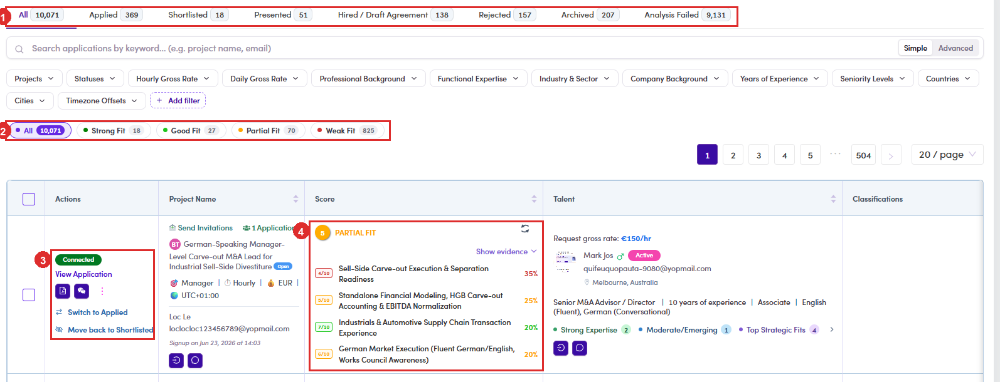

# C3.1 · The six stages

> C3 · Work the applications

**Project Management → Project Applications.** The tabs are the pipeline, in order.

*C3.1: ① the pipeline tabs · ② the fit filter · ③ the actions on a row · ④ the score, with Show evidence opened.*

| Stage | Meaning |
|---|---|
| **Applied** | they put themselves forward. Nobody has read it yet. |
| **Shortlisted** | you have read it and it is worth the client's time. |
| **Presented** | the client has seen them. |
| **Hired / Draft Agreement** | the client wants them; contracting starts. |
| **Rejected** | a decision was made and it was no. |
| **Archived** | filed away without a decision. |

> **Analysis Failed is not a stage, and it is the biggest tab**
>
> Counted in one snapshot: **9,131 of 10,071 applications** sit in **Analysis Failed**, against **940** spread across all six real stages. That is **91%** of everything ever submitted, and it means the scoring never ran on them. **They are not rejected and nobody has looked at them.** If you only ever read the pipeline tabs, you are reading the smaller half of the story. Check this tab before telling anybody a project had no suitable applicants.
