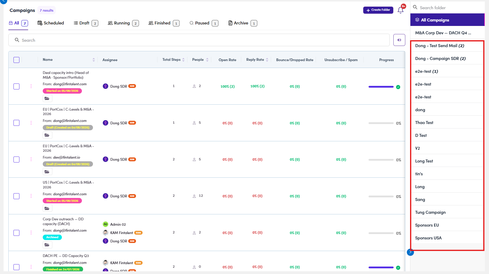

# CMP-09 · Folder rail scope

> 6‡ · Manage a campaign, issues → 6‡.0 · The register

**What happens.** Signed in as an SDR with **7 campaigns**, the folder rail lists seventeen folders, among them *Thao Test*, *tin’s*, *Sang*, *Tung Campaign*, *Sponsors EU* and *Sponsors USA*, several with a count beside the name.

**What should happen.** An SDR should see a folder only when one of two things is true: **they created it**, or **it holds a campaign assigned to them**. Everything else belongs to somebody else's work.

**Why it matters.** The rail is a directory of who is running what, printed to a role that is not supposed to have it. The campaign data underneath is scoped correctly, which makes this worse rather than better: the names and counts leak while the contents do not, so nobody notices.

*CMP-09: seven campaigns in the list, seventeen folders in the rail.*

Related: [6† ↗](6-manage-a-campaign-audited.md) found the same rail printing other people's counts through the API. This adds the rule the rail should follow. Guide: [6.3 ↗](6-3-view-campaigns.md).
