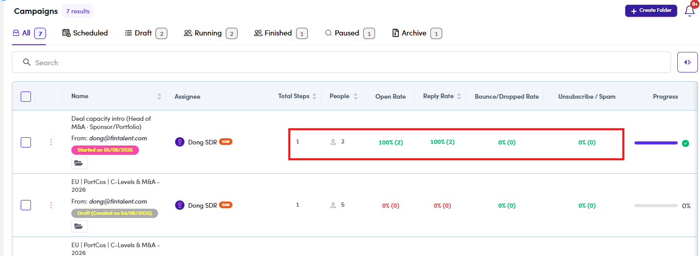

# CMP-10 · Numbers lead nowhere

> 6‡ · Manage a campaign, issues → 6‡.0 · The register

**What happens.** **Total Steps**, **People**, **Open Rate**, **Reply Rate** and **Bounce / Dropped Rate** are printed as plain text. Reading one and wanting the detail behind it means opening the campaign and finding the right tab yourself.

**What should happen.** Every number opens the view that explains it:

| Click | Opens |
|---|---|
| **Total Steps** | campaign → **Steps** |
| **People** | campaign → **People** |
| **Open Rate** | campaign → **Inbox**, filtered to **Open** |
| **Reply Rate** | campaign → **Inbox** |
| **Bounce / Dropped Rate** | campaign → **Inbox**, filtered to **Bounced / Dropped** |

**Why it matters.** The list is where the work starts every morning. A number that cannot be opened is a number you read and then have to go and find again.

*CMP-10: the five numbers, none of them a link.*

Two of these destinations do not work yet either, see [CMP-13](cmp-13-open-click-bounced.md). Guide: [6.8.1 ↗](6-8-1-read-the-numbers.md).
