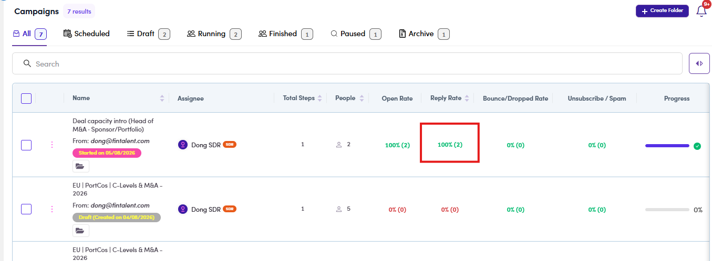

# CMP-11 · Reply Rate

> 6‡ · Manage a campaign, issues → 6‡.0 · The register

**What happens.** A campaign with **2 contacts** and **1 step**, both delivered. **One** of the two answered, and that one person sent **two** replies. The row reads **Reply Rate 100% (2)**.

**What should happen.** The count of **2** is right, the percentage is not. Reply rate is people who answered over people delivered to, which is **1 of 2, 50%**. As printed, one talkative contact can carry the rate past 100%.

**Why it matters.** This is the number the campaign is judged on. It is also the same defect as **ME-01** on the marketing-email side, where Open Rate printed **173.5%**, so it is one fix in two places rather than two problems.

*CMP-11: 2 people, 1 step, both delivered, one replier: 100% (2).*

Guide: [6.8.1 ↗](6-8-1-read-the-numbers.md).
