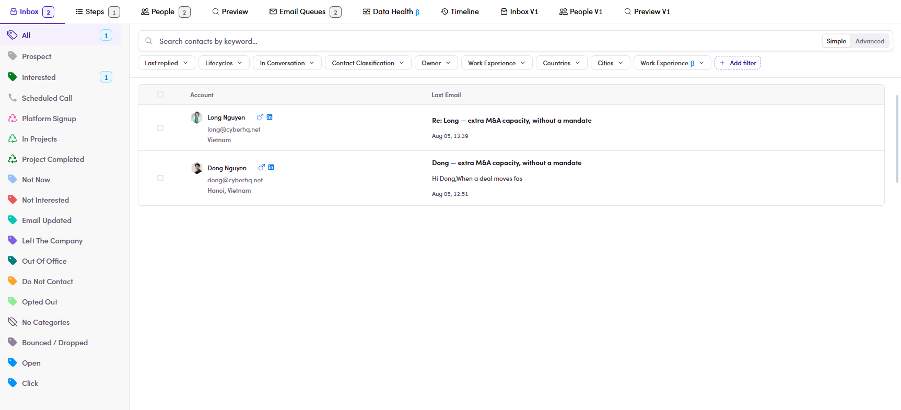

# CMP-12 · No lifecycle on rows

> 6‡ · Manage a campaign, issues → 6‡.0 · The register

**What happens.** The rail reads **Interested 1**. The list next to it shows two contacts, neither carrying a chip, so there is no way to tell which of the two is the interested one without clicking the category and watching the list shrink.

**What should happen.** The row shows the lifecycle it holds, the way the conversation view already does on the message.

**Why it matters.** The rail says how many, the list says who, and the two are not joined up. On a campaign with two people it is a small annoyance. On one with two hundred it is the difference between reading the inbox and querying it.

*CMP-12: Interested 1 on the left, two unmarked rows on the right.*

Guide: [6.8.3 ↗](6-8-3-replies-and-their-chips.md).
