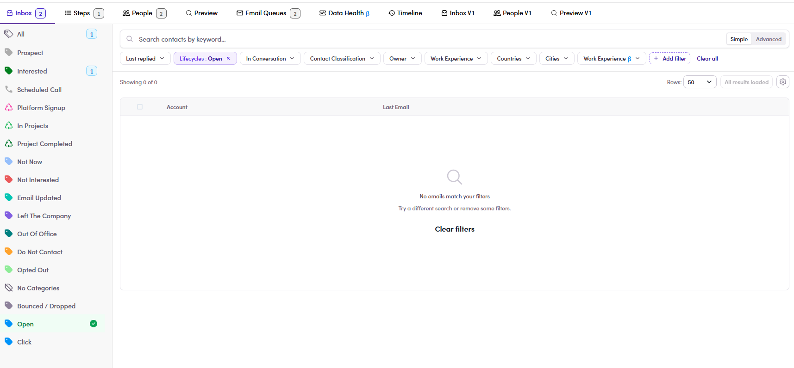
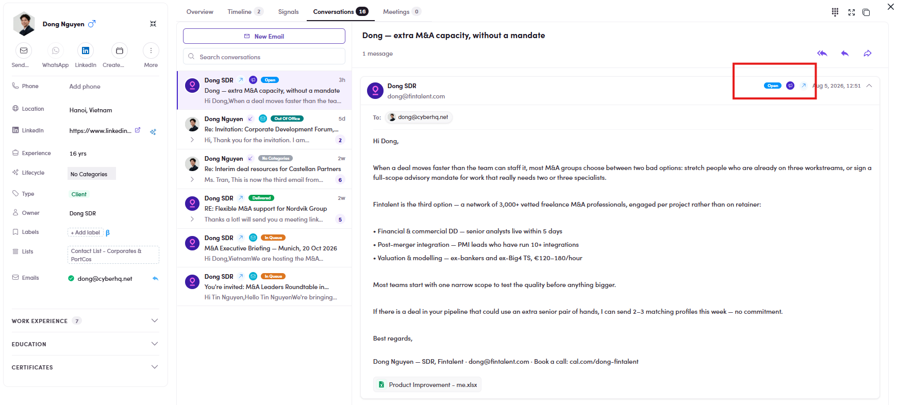

# CMP-13 · Open / Click / Bounced

> 6‡ · Manage a campaign, issues → 6‡.0 · The register

**What happens.** Clicking **Open** on the rail applies a chip reading **Lifecycles : Open** and the list goes to **Showing 0 of 0**, *No emails match your filters*. There is an open to find: the same contact's conversation carries the **Open** chip on the message. **Click** and **Bounced / Dropped** behave the same way.

**What should happen.** The category returns the contacts whose mail was opened, clicked, bounced or dropped.

**Why it matters.** Worth reading the chip the filter produces, because it names the cause. **Open is not a lifecycle.** Neither is Click, nor Bounced / Dropped: they are email events, and the rail is pushing all of them through the **Lifecycles** filter, which can only match lifecycle values. That is why **Interested** works and these three cannot. It also means the whole delivery half of the rail is unusable, and [CMP-10](cmp-10-numbers-lead-nowhere.md) would send people straight into it.

*CMP-13: Open ticked on the rail, chip reads Lifecycles : Open, list reads 0 of 0.*

*CMP-13: the same period, the same contact, the message carrying an Open chip. The data exists; the filter cannot reach it.*

Guide: [6.8.4 ↗](6-8-4-filter-by-category.md).
