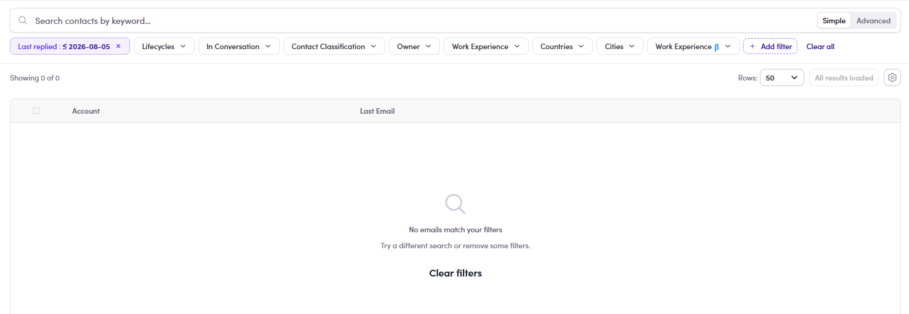
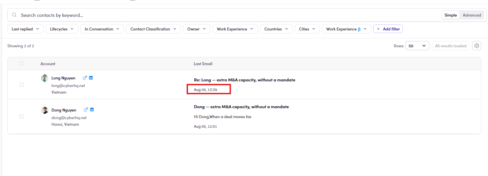

# CMP-14 · Last replied

> 6‡ · Manage a campaign, issues → 6‡.0 · The register

**What happens.** **Last replied : ≤ 2026-08-05** returns **Showing 0 of 0**. Two replies exist on that date, timestamped **Aug 05, 12:51** and **Aug 05, 13:39**, and both are visible in the unfiltered list.

**What should happen.** **≤ 5 August** includes everything that happened on 5 August.

**Why it matters.** A boundary compared at midnight rather than at the end of the day quietly hides today's replies, which are the ones you are looking for. Because the filter returns a clean empty state rather than an error, it reads as *nobody replied*.

*CMP-14: the chip reads ≤ 2026-08-05, the list reads 0 of 0.*

*CMP-14: the same list without the filter, both replies dated Aug 05.*

Guide: [6.8.4 ↗](6-8-4-filter-by-category.md).
