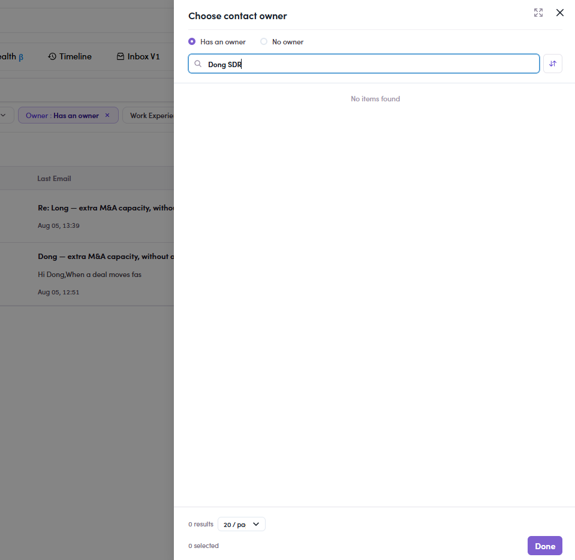
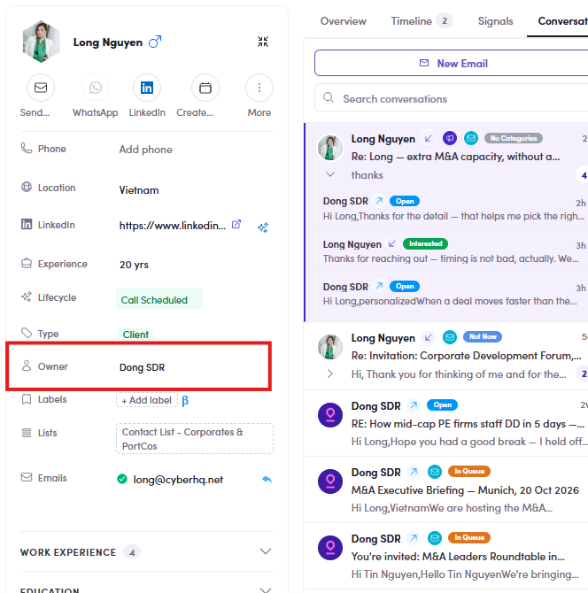

# CMP-15 · Owner picker

> 6‡ · Manage a campaign, issues → 6‡.0 · The register

**What happens.** **Owner → Has an owner** opens *Choose contact owner*. Typing **Dong SDR** returns **No items found**, **0 results**, on a campaign whose contacts are owned by Dong SDR, which the contact drawer prints in plain text.

**What should happen.** The picker lists the owners that exist on the data, so the obvious question, *which of these are mine*, can be answered.

**Why it matters.** **Has an owner** and **No owner** work, so the filter looks alive while the only useful part of it is empty. The list it should be reading is not the one it is reading.

*CMP-15: searching Dong SDR, 0 results.*

*CMP-15: the same contact, Owner: Dong SDR.*

Guide: [Flow 8 ↗](8-using-filters.md).
